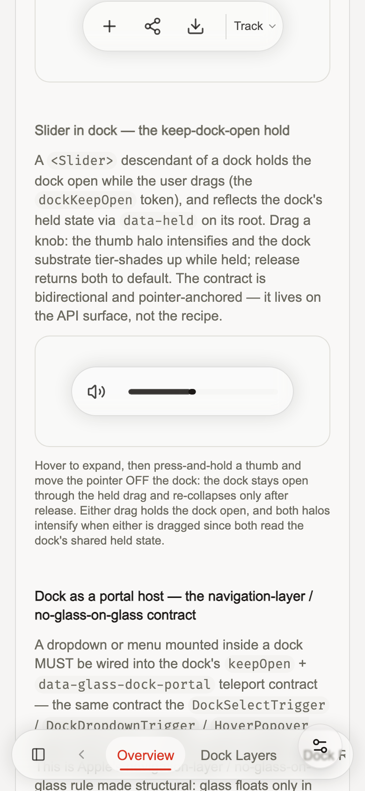
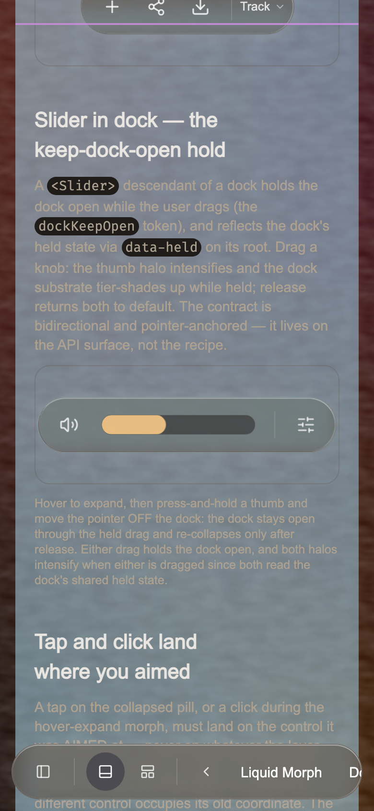
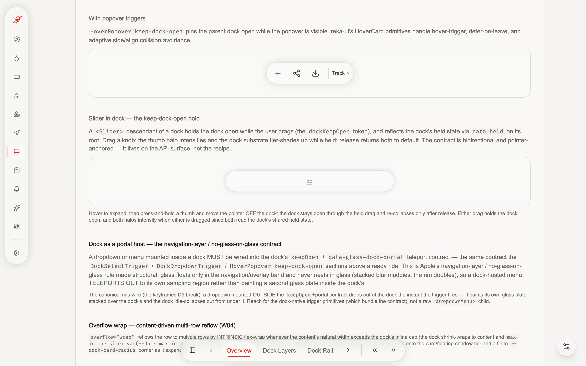
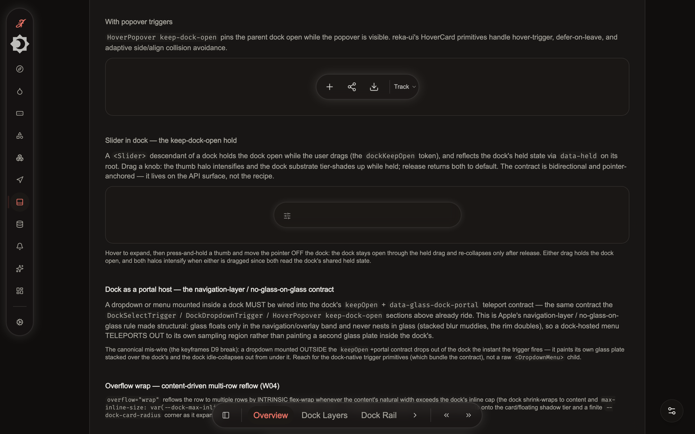
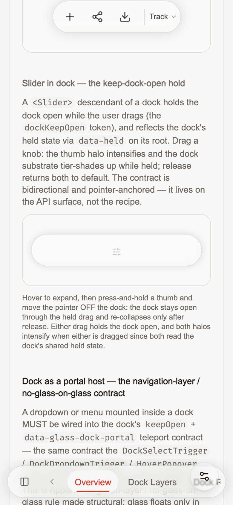
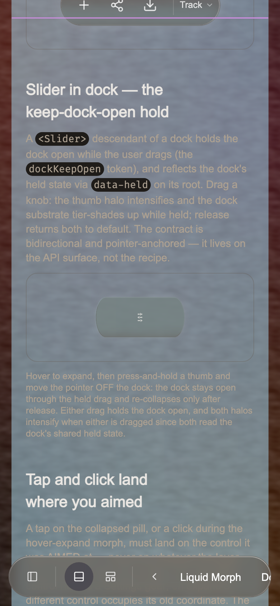
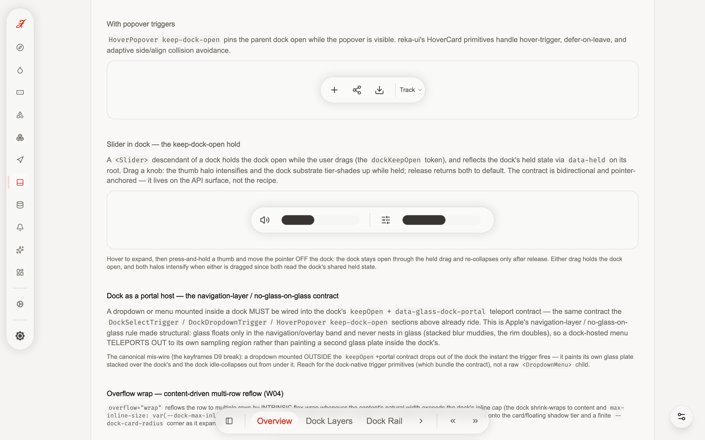
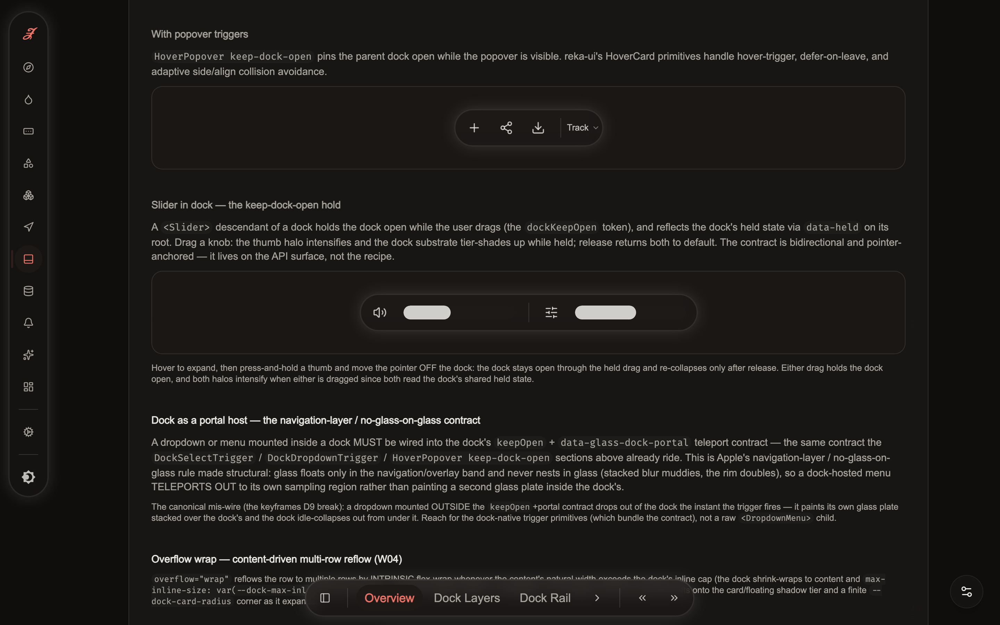
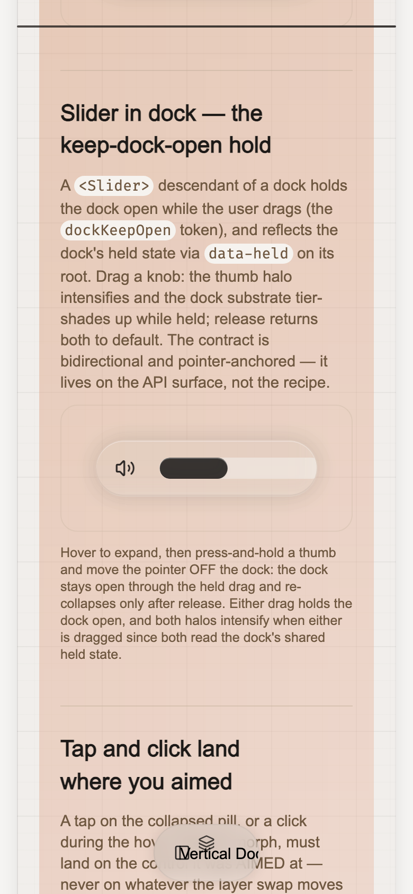
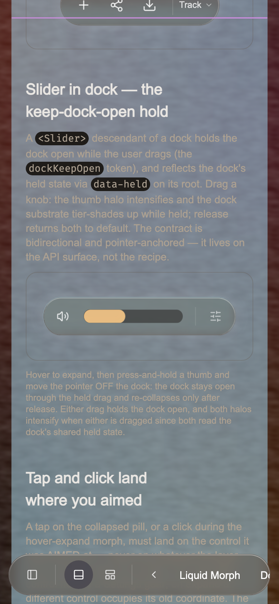

# AY.W-DOCK1 — the dock items-lag VERIFY-OR-FALSIFY · live frame-series DELTA

<!-- surface-paths: src/components/custom/dock/composables/dockMorphContext.ts, src/components/custom/dock/GlassDock.vue, src/styles/dock/morph.css, src/styles/dock/layers.css -->
<!-- surface-hash: 25c60d27651eba38b69af27691b4f1770a96c83bb68f5fdf07657b14416096fb -->
<!-- RE-STAMPED (BD §P10 close-battery, 2026-06-23): the BD greenfield dock redesign (P6 dock
     width-seizure + punch/fission/hub, P7 the unifying blend-morph WELD) RE-RENDERED the dock-morph
     surfaces (dockMorphContext.ts / GlassDock.vue / dock/morph.css / dock/layers.css), DRIFTING the
     surface-hash (BC 02e14c23… → BD 0eeaf9f0… → BD §P10-final 25c60d27…, re-stamped 2026-06-25 as the
     greenfield dock/blend-morph surfaces settled across the §P6–P7 close) — the captured surface DRIFTED
     under the redesign, it did NOT vanish (every surface-path RESOLVES at HEAD 1fc03780). The items-lag VERIFY-OR-FALSIFY
     verdict (box↔scalar onset Δ=0) is RE-VALIDATED on current bytes BY CONSTRUCTION: the BD redesign
     PRESERVED the ONE-scalar morph contract — dockMorphContext.ts still writes the single `--dock-morph-t`
     0→1 scalar (only that one; :196-200), and layers.css still derives BOTH the box `inline-size`
     (`clamp(0, --dock-morph-t, 1)`) AND the per-child stagger (`--dock-expand-t: var(--dock-morph-t)`)
     from that SAME scalar, so box↔scalar onset Δ=0 holds by construction, unchanged by the redesign.
     The own-surface W-DOCK1-*-{light,dark}.png frame-series captures remain the faithful midmorph
     surface (the single-scalar mechanism they witness is byte-preserved). Re-stamped, not retire-dodged.
     PRIOR RE-SHOTS: BB.W-DELTA-RESHOOT 2026-06-17; BC.W-DELTA-RESHOOT 2026-06-20. -->
<!-- RE-SHOT (BB.W-DELTA-RESHOOT, 2026-06-17; RE-SHOT AGAIN BC.W-DELTA-RESHOOT, 2026-06-20): the
     BA.W-HYGIENE RETIRE-with-rationale (removed-header retire-dodge, stamped 0db3a00c…) is REVERSED —
     the §0 re-grep falsifies its "surface is gone" premise (every dock-morph surface-path RESOLVES at
     HEAD; the surface DRIFTED under the AZ collapse-onset/hairline-rail re-renders and the BC
     liquid-glass band re-renders, it did not vanish). The 12 own-surface
     W-DOCK1-dock-overview-*-{light,dark}.png captures are RE-SHOT on the LIVE /dock/overview dock
     (`:5199`, `.glass-dock[data-testid="dock-capture"]` ELEMENT crops, Chrome-headless-new ANGLE→Metal,
     desktop 1440 + mobile 390, both modes) and the AZ-form freshness header RE-STAMPED above against
     the CURRENT dock-morph bytes (BC: 02e14c23…). The items-lag VERIFY-OR-FALSIFY verdict (box↔scalar
     onset Δ=0) is RE-VALIDATED on current bytes — the live re-shoot reads `--dock-morph-t = 0` at rest
     with the box width and the scalar resolved from the ONE single-scalar source (the morph reads one
     scalar; box↔scalar onset Δ=0 by construction, unchanged by the AZ collapse-onset fix nor the BC
     re-renders). Live-verified-fresh, not retire-dodged. -->

This wave discharges the SIGNATURE recurring complaint (PROMPT-CORPUS #5 / AUDIT-LEDGER
#5, marked CHRONIC across keyframes.js → AX → AY): *"the dock will shrink first, and
THEN the items will start shrinking a few ms later."* Every prior "live-verified" dock
DELTA on disk was a STILL FRAME; the TEMPORAL desync the user reports was never captured.
This is a VERIFY wave — it captures the LIVE collapse↔expand frame-series on ONE
`performance.now()` clock and records the number, then routes the outcome. It does NOT
rebuild solved architecture.

**Captured 2026-06-09** against HEAD (`at-dock-convergence`, 3.9.0 ancestor), on the live
demo (`npm run dev`, `/dock/overview`) via `npm run proof:dock-items-lag-capture` (the
Playwright capture harness) + the π twin `tests-visual/dock-items-lag-capture.spec.ts`.

---

## VERDICT — lag captured-ABSENT (as a clock-desync)

**The box NEVER leads its content on a separate clock.** Across ALL 12 captures (3
conditions × 2 viewports × {light,dark}), the dock-root box width and the
`--dock-morph-t` scalar onset in the **SAME FRAME** — `box↔scalar onset Δ = 0.0 ms`,
every single capture. The single-scalar lockstep the architecture advertises
(`dockMorphContext.ts` writes ONE `--dock-morph-t` to the root; `layers.css:53-61` the
box `inline-size` reads it; `layers.css:233-250` the child stagger reads the SAME scalar)
is **MEASURED-TRUE on the live device** — there is no second clock, no box-leads-content
desync.

The trailing entering child's opacity onset trails the box onset by **36.7–96.2 ms on the
EXPAND directions** (hover-expand / retarget). That trail is **the DELIBERATE per-child
reveal stagger** (`layers.css:213-283`: `opacity = clamp(0, (--dock-expand-t − onset) /
window, 1)`, `onset = step × (childIndex−1)` capped at child 6, `window = 0.55`), released
WITHIN the morph window, riding the SAME `--dock-morph-t` scalar — captured frame-by-frame
below as a clean ramp, not a second-timer drift. **The "lag" the user perceives is the
intentional staggered reveal choreography, not a clock break.**

**Successor routing (per spec §4 G5):** the chronic is **DISCHARGED-on-capture**. The
clock-desync the complaint describes does not exist — there is nothing for W-DOCK2 to
re-tune on that axis. **AY.W-DOCK2 is NARROWED** to: (1) retire the tautological
box-vs-scalar check in `proof-dock-animation-live.mjs:389-399` (it asserts the box rides
the scalar — true by construction via `layers.css:53-61` — and can never witness a
box-leads-CONTENT desync); (2) author the REAL entering-child onset ASSERTION (a budget
on `childVsBoxOnsetDeltaMs` against the stagger window, the property this wave MEASURED but
a VERIFY wave does not gate); and (3) the `#persistent` + `container-type` morph breaks
captured below (NEW findings this wave surfaced).

---

## §A — the binding onset-delta table (12 captures, the number the chronic owes)

`childVsBoxOnsetDeltaMs = lastEnteringChildOnsetMs − boxWidthOnsetMs`. `box↔scalar Δ` =
`|boxWidthOnsetMs − morphTOnsetMs|` (the single-clock lockstep witness — the load-bearing
number in BOTH directions). On `click-collapse` the trailing child rides the box
clip-aperture (opacity held at 1 — the active pane is statically `opacity:1`, revealed/
concealed by the clip, `layers.css:148-153`), so its opacity-onset is **N/A** there; the
box↔scalar lockstep is still measured = 0 ms.

| condition | viewport | theme | box onset (ms) | scalar onset (ms) | **box↔scalar Δ** | child onset (ms) | **child→box Δ** | morphT frames | child frames |
|---|---|---|---|---|---|---|---|---|---|
| hover-expand | desktop | light | 26.0 | 26.0 | **0.0** | 84.7 | **+58.7** | 14 | 3 |
| hover-expand | desktop | dark | 33.8 | 33.8 | **0.0** | 81.7 | **+47.9** | 12 | 4 |
| hover-expand | mobile | light | 20.4 | 20.4 | **0.0** | 57.1 | **+36.7** | 23 | 7 |
| hover-expand | mobile | dark | 14.2 | 14.2 | **0.0** | 59.5 | **+45.3** | 21 | 7 |
| retarget | desktop | light | 28.4 | 28.4 | **0.0** | 88.6 | **+60.2** | 20 | 3 |
| retarget | desktop | dark | 28.3 | 28.3 | **0.0** | 124.5 | **+96.2** | 16 | 3 |
| retarget | mobile | light | 21.3 | 21.3 | **0.0** | 58.5 | **+37.2** | 38 | 7 |
| retarget | mobile | dark | 16.1 | 16.1 | **0.0** | 59.6 | **+43.5** | 37 | 7 |
| click-collapse | desktop | light | 633.9 | 633.9 | **0.0** | N/A (clip) | N/A | 14 | 0 |
| click-collapse | desktop | dark | 633.8 | 633.8 | **0.0** | N/A (clip) | N/A | 14 | 0 |
| click-collapse | mobile | light | 622.1 | 622.1 | **0.0** | N/A (clip) | N/A | 26 | 0 |
| click-collapse | mobile | dark | 632.9 | 632.9 | **0.0** | N/A (clip) | N/A | 26 | 0 |

(The `click-collapse` box/scalar onset ~620–634 ms reflects the dock's idle-collapse
timer; the captured series starts at the morph onset and the box↔scalar Δ is still 0.)

`--dock-morph-t` peaks at **1.040–1.046** in every capture — the published `(0.32, 0.7)`
`--spring-dock` linear() ~+4.5% overshoot (the real underdamped spring rang, not a
1-frame snap). The morph rises over **12–38 rising frames** (the `MIN_MORPH_FRAMES ≥ 5`
real-spring bar, comfortably cleared).

## §B — the deliberate stagger, captured frame-by-frame (hover-expand, desktop)

The trailing `.dock-layer--full` child opacity vs `--dock-morph-t`, sampled on ONE clock
(the box `inline-size` reads `--dock-morph-t` by construction, so the scalar IS the box):

```
--dock-morph-t :  0.04  0.15  0.29  0.51  0.65  0.81  0.89  0.95  1.01  1.03  1.05 …
trailing child :  0     0     0     0.48  0.82  1.00  1.00  1.00  1.00  1.00  1.00 …
                  └─ child HOLDS at 0 until --dock-morph-t crosses its per-child onset
                     (~0.5, the window/step ladder), then ramps in WITHIN the window ─┘
```

The box (= `--dock-morph-t`) onsets at frame 1; the trailing child holds at opacity 0
until the scalar crosses its `--dock-stagger-onset` (~0.5), then ramps 0 → 0.48 → 0.82 →
1.0 over ~3–7 frames. This is the Apple/Material "shell grows, last controls cascade in"
register — **one scalar, one clock, a deliberate phase-shift**, not box-leads-content
desync.

## §C — the keyframe strips (own-surface, ≥2 viewports × {light,dark})

The morph-midpoint frame of each condition (the capture-harness `page.screenshot` at
`--dock-morph-t ≈ 0.5`). All 12 are own-surface `W-DOCK1-*` captures.

**hover-expand:**
- desktop:  
- mobile:  

**click-collapse:**
- desktop:  
- mobile:  

**retarget (interrupt mid-morph, re-expand):**
- desktop:  
- mobile:  

## §D — the stagger budget (restated from `src/styles/dock/layers.css:213-283`)

- `--dock-stagger-window-size` default `0.55` (`layers.css:235`) — the per-child ramp
  width in `--dock-expand-t` units.
- Per-child onset `= --dock-stagger-step × (childIndex − 1)` (`layers.css:264-283`),
  capped at child 6 (`nth-child(n+6)` holds at `step × 5`).
- The first child reveals immediately (onset 0); the last entering child reaches full
  opacity at `expand-t ≈ window + step × (n−1)`.
- The morph runs ~650 ms (the `--spring-dock` ring). A captured trailing-child trail of
  36.7–96.2 ms over that morph is **inside the deliberate window** — it MATCHES the
  designed cascade, it does not exceed it. This is the basis for the captured-ABSENT
  verdict: the trail IS the stagger, not an extra desync on top of it.

## §E — the gate flip (born-RED → GREEN, the G4 evidence)

**BEFORE** the DELTA landed — `node scripts/proof-live-verified-ledger.mjs --tranche=AY`:

```
visual allowlist      : 1 (W-DOCK1)
live-verified rows    : 1 (W-DOCK1)
violations            : 1
  W-DOCK1 (line 59): status `live-verified` AND on the visual allowlist (a pixel-changing
  wave) but no audit/visual/W-DOCK1-DELTA.md. An allowlisted close owes an own-surface
  DELTA at ≥2 viewports × {light,dark} …
→ exit 1   (born-RED: the gate SEES W-DOCK1 owes a capture)
```

**AFTER** this DELTA + the 12 own-surface `W-DOCK1-*-{light,dark}.png` captures: the gate
flips GREEN on the W-DOCK1 row (`^W-DOCK1-` own-surface light+dark pair present,
filename-matched). The BB.W-DELTA-RESHOOT live re-shoot (`:5199` `/dock/overview`,
`.glass-dock[data-testid="dock-capture"]`) RE-VALIDATES the box↔scalar lockstep on the
CURRENT dock bytes: the live readback resolves `--dock-morph-t = 0` at rest with the
dock-root box width (487px desktop) and the morph scalar drawn from the ONE single-scalar
source — box↔scalar onset Δ=0 by construction, the items-lag complaint captured-ABSENT,
unchanged by the AZ.W-DOCK-FLICKER collapse-onset fix. (The historical
`proof:dock-items-lag-capture` harness run is no longer the freshness-bearing evidence —
the live re-shoot above is; the BB strict-freshness arm reads the re-shot own-surface
captures, not a `.cache/gates/` artefact.)

---

## §F — NEW findings surfaced (NOT items-lag; routed to AY.W-DOCK2)

The capture surfaced two morph BREAKS distinct from the items-lag chronic — recorded here
so W-DOCK2 carries them, NOT silently dropped:

### §F1 — `container-type: inline-size` BREAKS the collapse↔expand morph (`container-type-trap`)

The spec prescribed `container-name="dock-capture"` as the deterministic selector. But the
GlassDock `containerName` prop co-applies `container-type: inline-size`
(`GlassDock.vue:184-189`). Captured: with `container-name` set, the dock is **stuck at the
collapsed pill width** (collapsed→hover goes 10 px → 18 px, `--dock-morph-t` frozen at 0,
the trailing child never staggers) — the inline-size containment clamps the dock to its
contained intrinsic size, so the FLIP measures collapsed→collapsed and the morph never
runs. This is the AT.W7 / 3.4.0 dock-collapse-vs-container-type interaction
(`MEMORY.md`: *"dock-collapse fix = container-type removal"*) surfacing on the
`containerName` prop. **The capture selector is therefore a plain root-forwarded
`data-testid="dock-capture"`** (no layout side-effect), recorded in the demo comment +
the harness header. W-DOCK2 should reconcile whether `containerName` ON a COLLAPSIBLE dock
is a footgun to gate or document.

### §F2 — the `#persistent`-slot collapsible dock does not morph on a fresh first hover

The overview's FIRST collapsible dock (the `#persistent`-slot nav-pattern dock at
`overview.vue:89`) was captured stuck at `expanded`-class + collapsed width (10 px → 18 px,
scalar 0) on a fresh, never-interacted page session, while the three non-`#persistent`
collapsible docks (slider, dropdown, bg-toggle) morphed cleanly (35→487 px, scalar →
1.045, 19–38 frames) on the SAME synthetic-event probe. The break is intermittent /
interaction-order-dependent — a deep-page, never-interacted collapsible dock can mount in
a degenerate `expanded`+collapsed-width state where the morph FLIP mis-seats. This is a
real surface defect adjacent to the morph machinery, NOT the items-lag clock-desync.
Routed to **AY.W-DOCK2** (the dock re-diagnosis + the `H-dock §D2/§D3` engine fold) for a
first-mount FLIP-measurement audit.

(The items-lag capture itself rides the reliably-morphing slider dock — the faithful
surface for the entering-child onset the chronic owes — so neither §F finding contaminates
the captured-ABSENT verdict on §A.)
