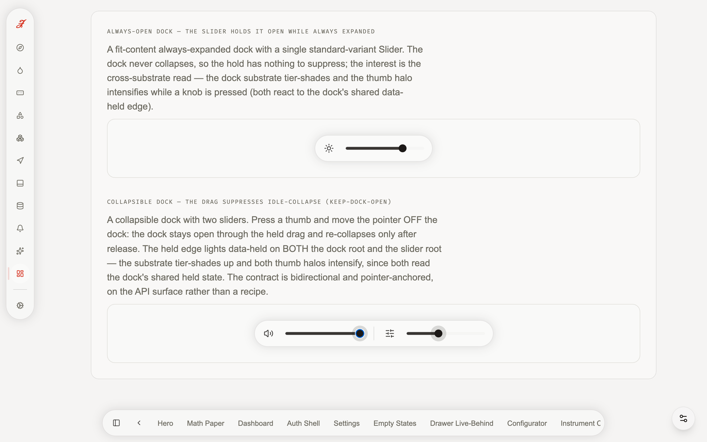
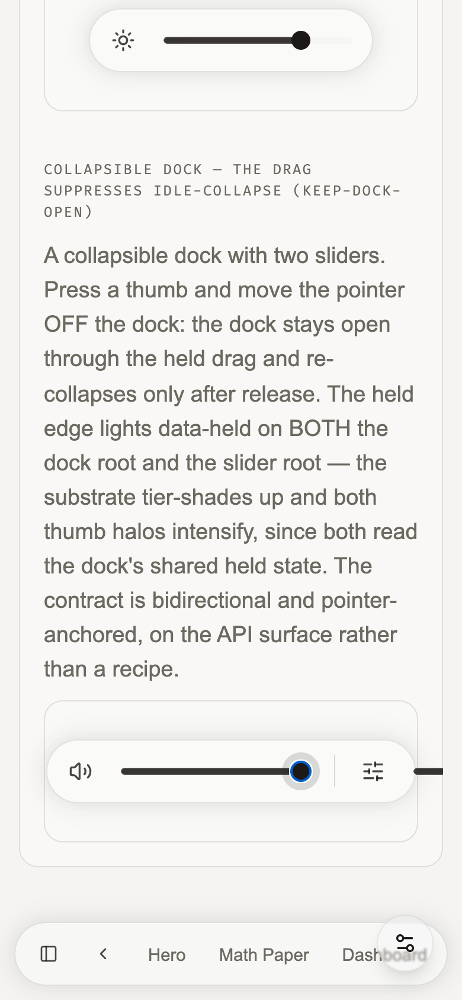
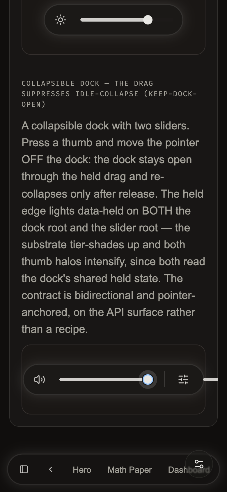
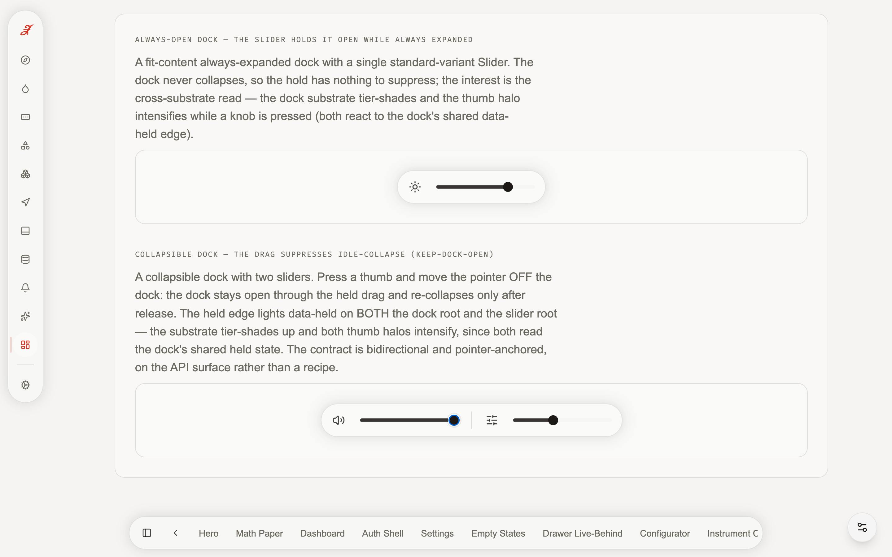
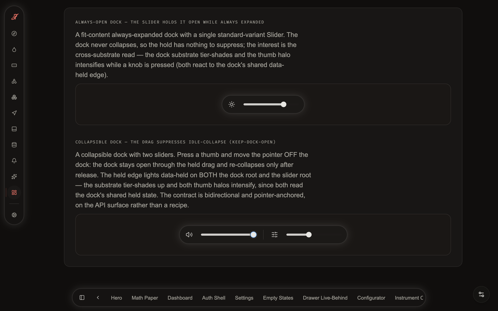
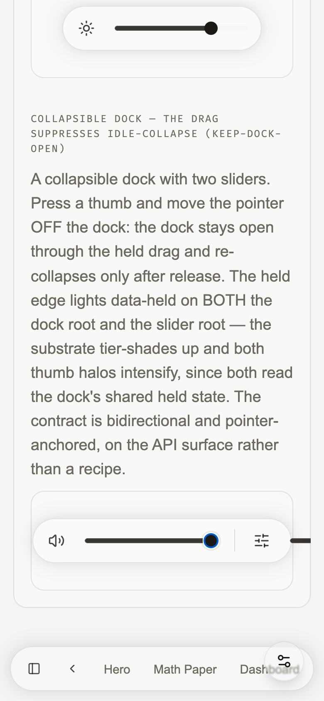
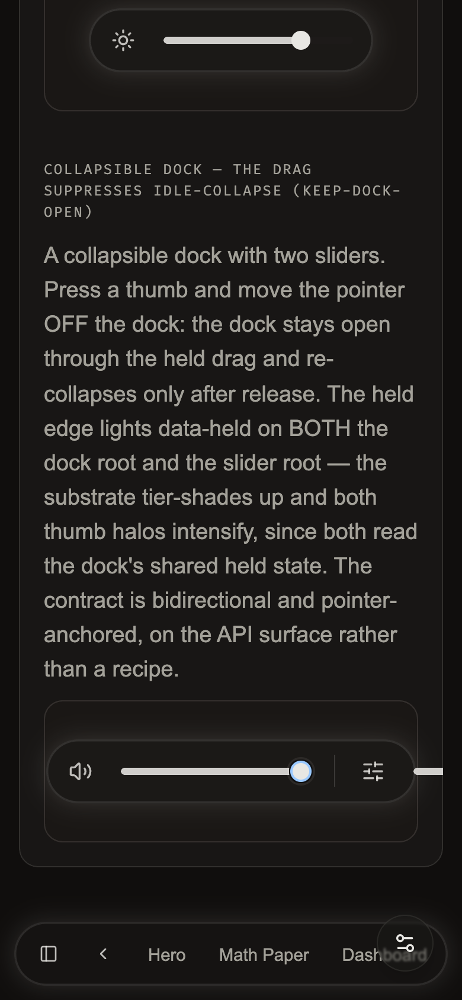

# AY.W-DOCK3 — dock-with-slider keepDockOpen · live drag DELTA

The cross-substrate `keepDockOpen` contract had a CANONICAL live home owed (the
CLAUDE.md Slider section pointed at `demo/stories/compositions/dock-with-slider.vue`,
which did not exist on the live tree) and ZERO captured visual truth — the static mount
gate `proof:dock-hold-contract` proves the WIRING (`keepOpen()` fires, `data-held`
paints), but never the LIVE/VISUAL register the user reports ("the dock-with-a-slider is
broken"). This wave authors the focused proof story and captures the drag DELTA: a real
`page.mouse.*` drag holds the dock open through the gesture (idle-collapse suppressed past
the 600ms delay), with `data-held` lit on BOTH the dock root and the slider root and the
thumb-halo intensified.

**Captured 2026-06-09** against the live demo (`/compositions/dock-with-slider`) on
chromium-headless-new (π-lane Playwright, Metal GPU), via
`tests-visual/dock-with-slider-live.spec.ts`. The drive is a REAL `page.mouse.down()` on a
slider thumb + a `page.mouse.move()` OFF the dock (NOT a synthetic dispatch), so the native
`pointerdown` → window-`pointerup` hold path in `useDockHold` is exercised end-to-end.

## Captures (own-surface, ≥2 viewports × {light,dark})

| frame | viewport | light | dark |
|-------|----------|-------|------|
| held (mid-drag, pointer off-dock) | desktop 1440 | `W-DOCK3-dock-slider-held-desktop-light.png` | `W-DOCK3-dock-slider-held-desktop-dark.png` |
| held | mobile 390 | `W-DOCK3-dock-slider-held-mobile-light.png` | `W-DOCK3-dock-slider-held-mobile-dark.png` |
| released | desktop 1440 | `W-DOCK3-dock-slider-released-desktop-light.png` | `W-DOCK3-dock-slider-released-desktop-dark.png` |
| released | mobile 390 | `W-DOCK3-dock-slider-released-mobile-light.png` | `W-DOCK3-dock-slider-released-mobile-dark.png` |

**held (the binding frame):**
- desktop:  
- mobile:  

**released:**
- desktop:  
- mobile:  

## The paired-π `data-held` readback (the binding behavioural truth)

A real drag sampled at REST (hovered, before press) → HELD (mid-drag, pointer moved OFF
the dock, PAST the 600ms collapse-delay) → RELEASED (`page.mouse.up()`), reading both roots
+ the slider-thumb halo via `getComputedStyle` (desktop/light; the other 3 conditions
match):

| signal | REST | HELD (off-dock) | RELEASED | verdict |
|--------|------|-----------------|----------|---------|
| `.glass-dock` `data-held` | absent | **present** | absent | the dock observes the keep-open token while the gesture is live ✓ |
| `.glass-slider` `data-held` | absent | **present** | absent | the slider reflects the dock's shared held edge ✓ |
| dock `.expanded` class | expanded | **expanded** (idle-collapse SUPPRESSED) | expanded | the hold kept the dock open past the 600ms delay ✓ |
| slider-thumb `box-shadow` halo | `none` | `0 0 0 8px` @ `srgb 0.11 0.098 0.09 / 0.15` (`--surface-tint-15`) | `0 0 0 4px` @ `/ 0.08` (`--surface-tint-8`, the hover rung) | the held halo INTENSIFIES (8px @ 15%) over the hover halo (4px @ 8%) ✓ |

The held halo (`0 0 0 8px var(--surface-tint-15)`) is the `Slider.vue:278-280`
`.glass-slider[data-held] .slider-thumb` rung; the release settles to the `:hover` rung
(`0 0 0 4px var(--surface-tint-8)`, `Slider.vue:258-261` — the pointer is still hovering
after `mouse.up`). The dock `--glass-tint-strength` stays `0%` (the W55 zero-delta default;
no adaptive darken is in play on this flat substrate — disjoint axis, as designed).

## Visual verdict (the screenshots)

**PASS.** The held frame shows the collapsible dock (the lower cell, `data-testid=
"dock-slider-hold-root"`) OPEN — both sliders visible — with the volume thumb's halo
intensified to the denser ring, while the pointer is OFF the dock and the 600ms collapse-
delay has elapsed. An UN-held dock would have idle-collapsed to the pill; the held dock
stays a full glass plate. The released frame shows the same dock still open (the pointer is
hovering after release) with the halo settled back to the hover rung. The mobile captures
are a genuine 390-wide viewport (the dock overflows the narrow column — the honest mobile
rendering), centred on the held dock so the claim is legible. Light and dark both read the
held substrate tier-shade.

## The gate flip (born-RED → GREEN)

`proof:live-verified-ledger:ay` (`--tranche=AY`) holds the `W-DOCK3` PROGRESS row to the
deepened own-surface bar (the wave is on `VISUAL-ALLOWLIST.json`): the row may carry
`live-verified` ONLY because this DELTA references ≥1 own-surface real on-disk PNG matching
`^W-DOCK3-` with a `{light,dark}` pair. Bite: delete the captured PNGs (or revert this doc
to prose) → the `W-DOCK3` row reds the ledger gate; the self-test (3 synthetic rows) passes
on every run. The π spec `tests-visual/dock-with-slider-live.spec.ts` is the LIVE bite:
disarm the hold (`:keep-dock-open="false"`, or orphan the `useDockHold` native listener) →
the mid-drag `data-held` assertion fails AND the dock idle-collapses mid-hold → spec RED.

## What stayed out of this wave (the routing record)

- **No glass-ui progress-bar gate.** `grep -rin progress src/components/custom/dock/
  src/styles/dock/` returns only `--dock-morph-t` scalar comments — `GlassDock` bakes no
  progress bar, so there is NO glass-ui edit-site. The "progress bar off the dock"
  condition is a SLIDES concern (already de-docked at slides H.W2 —
  `slides/src/styles/deck.css` "DE-DOCKED PROGRESS BAR axes"; `DeckView.vue` renders
  `.deck-progress` as a viewport-pinned PAGE element), re-homed to the L tranche as a
  non-regression verify-row, carrying no glass-ui assertion.
- **No library `src/` edit.** `Slider.vue` / `useDockHold.ts` / `dock/morph.css` are all
  correct at HEAD — the hold is architecturally sound (the AX.W03 host-native fix). The
  only `src/`-adjacent change is the CLAUDE.md doc-fix (the now-real story path); everything
  else is `demo/`, `tests-visual/`, and this `docs/` DELTA.

## §F1 carry (from W-DOCK1) — the container-type trap avoided

The collapsible capture cell uses a plain `data-testid="dock-slider-hold-root"`, NOT the
GlassDock `containerName` prop (which co-applies `container-type: inline-size` and FREEZES
the collapse↔expand morph — the AT.W7 / 3.4.0 trap; see `W-DOCK1-DELTA.md §F1`). The
hold-capture drives a REAL pointer drag, so the dock must actually morph + hold; a
`containerName`-frozen dock would falsely pass the rest-state assertions and fail the live
drag.
