# Perfected BI topological strata

The bands are Kahn maximal ready sets, not thematic phases. Within each ready set, the launch batches below enforce the three-live-agent ceiling, declared semantic locks, and implicit exact-path write leases. No edge exists merely to force closure work last or to serialize otherwise independent writers.

```mermaid
flowchart LR
  BI_S00["BI.S00 · 1 waves"]
  BI_S01["BI.S01 · 1 waves"]
  BI_S02["BI.S02 · 4 waves"]
  BI_S03["BI.S03 · 3 waves"]
  BI_S04["BI.S04 · 1 waves"]
  BI_S05["BI.S05 · 3 waves"]
  BI_S06["BI.S06 · 1 waves"]
  BI_S07["BI.S07 · 1 waves"]
  BI_S08["BI.S08 · 1 waves"]
  BI_S09["BI.S09 · 3 waves"]
  BI_S10["BI.S10 · 4 waves"]
  BI_S11["BI.S11 · 4 waves"]
  BI_S12["BI.S12 · 3 waves"]
  BI_S13["BI.S13 · 9 waves"]
  BI_S14["BI.S14 · 3 waves"]
  BI_S15["BI.S15 · 25 waves"]
  BI_S16["BI.S16 · 19 waves"]
  BI_S17["BI.S17 · 16 waves"]
  BI_S18["BI.S18 · 14 waves"]
  BI_S19["BI.S19 · 8 waves"]
  BI_S20["BI.S20 · 3 waves"]
  BI_S21["BI.S21 · 1 waves"]
  BI_S22["BI.S22 · 1 waves"]
  BI_S23["BI.S23 · 2 waves"]
  BI_S24["BI.S24 · 2 waves"]
  BI_S25["BI.S25 · 1 waves"]
  BI_S00 --> BI_S01
  BI_S01 --> BI_S02
  BI_S02 --> BI_S03
  BI_S03 --> BI_S04
  BI_S04 --> BI_S05
  BI_S05 --> BI_S06
  BI_S06 --> BI_S07
  BI_S05 --> BI_S07
  BI_S07 --> BI_S08
  BI_S08 --> BI_S09
  BI_S09 --> BI_S10
  BI_S10 --> BI_S11
  BI_S11 --> BI_S12
  BI_S12 --> BI_S13
  BI_S13 --> BI_S14
  BI_S14 --> BI_S15
  BI_S11 --> BI_S16
  BI_S15 --> BI_S16
  BI_S16 --> BI_S17
  BI_S15 --> BI_S17
  BI_S17 --> BI_S18
  BI_S14 --> BI_S18
  BI_S15 --> BI_S19
  BI_S18 --> BI_S19
  BI_S16 --> BI_S20
  BI_S19 --> BI_S20
  BI_S16 --> BI_S19
  BI_S16 --> BI_S21
  BI_S17 --> BI_S21
  BI_S20 --> BI_S21
  BI_S19 --> BI_S22
  BI_S21 --> BI_S22
  BI_S02 --> BI_S17
  BI_S17 --> BI_S19
  BI_S22 --> BI_S23
  BI_S11 --> BI_S23
  BI_S11 --> BI_S14
  BI_S11 --> BI_S15
  BI_S13 --> BI_S15
  BI_S13 --> BI_S17
  BI_S14 --> BI_S17
  BI_S11 --> BI_S18
  BI_S13 --> BI_S18
  BI_S14 --> BI_S16
  BI_S11 --> BI_S19
  BI_S13 --> BI_S19
  BI_S14 --> BI_S19
  BI_S16 --> BI_S18
  BI_S11 --> BI_S17
  BI_S15 --> BI_S18
  BI_S02 --> BI_S19
  BI_S13 --> BI_S16
  BI_S13 --> BI_S23
  BI_S14 --> BI_S23
  BI_S23 --> BI_S24
  BI_S15 --> BI_S24
  BI_S12 --> BI_S15
  BI_S02 --> BI_S13
  BI_S17 --> BI_S25
  BI_S15 --> BI_S25
  BI_S18 --> BI_S25
  BI_S24 --> BI_S25
  BI_S12 --> BI_S20
  BI_S13 --> BI_S20
  BI_S09 --> BI_S20
  BI_S02 --> BI_S09
```

| stratum | width | resource-safe launch batches (≤3) |
| --- | --- | --- |
| BI.S00 | 1 | 1: BI.W-P000 |
| BI.S01 | 1 | 1: BI.W-P001 |
| BI.S02 | 4 | 1: BI.W-P002, BI.W-P003, BI.W-P004; 2: BI.W-P005 |
| BI.S03 | 3 | 1: BI.W-P006, BI.W-P131; 2: BI.W-P007 |
| BI.S04 | 1 | 1: BI.W-P008 |
| BI.S05 | 3 | 1: BI.W-P009; 2: BI.W-P011; 3: BI.W-P012 |
| BI.S06 | 1 | 1: BI.W-P010 |
| BI.S07 | 1 | 1: BI.W-P013 |
| BI.S08 | 1 | 1: BI.W-P014 |
| BI.S09 | 3 | 1: BI.W-P015, BI.W-P126; 2: BI.W-P133 |
| BI.S10 | 4 | 1: BI.W-P016; 2: BI.W-P019; 3: BI.W-P020; 4: BI.W-P021 |
| BI.S11 | 4 | 1: BI.W-P017; 2: BI.W-P018; 3: BI.W-P022; 4: BI.W-P055 |
| BI.S12 | 3 | 1: BI.W-P023; 2: BI.W-P057; 3: BI.W-P058 |
| BI.S13 | 9 | 1: BI.W-P024; 2: BI.W-P059, BI.W-P125; 3: BI.W-P060, BI.W-P061; 4: BI.W-P083; 5: BI.W-P085; 6: BI.W-P128; 7: BI.W-P129 |
| BI.S14 | 3 | 1: BI.W-P025; 2: BI.W-P033; 3: BI.W-P062 |
| BI.S15 | 25 | 1: BI.W-P026; 2: BI.W-P030; 3: BI.W-P031; 4: BI.W-P034, BI.W-P043; 5: BI.W-P063; 6: BI.W-P064; 7: BI.W-P066; 8: BI.W-P069; 9: BI.W-P070; 10: BI.W-P071; 11: BI.W-P072; 12: BI.W-P073; 13: BI.W-P075; 14: BI.W-P076; 15: BI.W-P077; 16: BI.W-P079; 17: BI.W-P084; 18: BI.W-P086; 19: BI.W-P100; 20: BI.W-P112; 21: BI.W-P115; 22: BI.W-P117; 23: BI.W-P120; 24: BI.W-P124 |
| BI.S16 | 19 | 1: BI.W-P027; 2: BI.W-P028; 3: BI.W-P032; 4: BI.W-P035; 5: BI.W-P044; 6: BI.W-P045; 7: BI.W-P067; 8: BI.W-P068; 9: BI.W-P080; 10: BI.W-P087; 11: BI.W-P095; 12: BI.W-P103; 13: BI.W-P104; 14: BI.W-P105; 15: BI.W-P109; 16: BI.W-P111; 17: BI.W-P116; 18: BI.W-P122; 19: BI.W-P123 |
| BI.S17 | 16 | 1: BI.W-P029; 2: BI.W-P036, BI.W-P046; 3: BI.W-P047; 4: BI.W-P048; 5: BI.W-P049; 6: BI.W-P050; 7: BI.W-P051; 8: BI.W-P065; 9: BI.W-P088; 10: BI.W-P089; 11: BI.W-P091; 12: BI.W-P092; 13: BI.W-P093; 14: BI.W-P096; 15: BI.W-P098 |
| BI.S18 | 14 | 1: BI.W-P037, BI.W-P052; 2: BI.W-P053; 3: BI.W-P074; 4: BI.W-P078; 5: BI.W-P082; 6: BI.W-P090; 7: BI.W-P094; 8: BI.W-P097; 9: BI.W-P099; 10: BI.W-P101; 11: BI.W-P106; 12: BI.W-P113; 13: BI.W-P114 |
| BI.S19 | 8 | 1: BI.W-P038, BI.W-P054; 2: BI.W-P040, BI.W-P081; 3: BI.W-P102; 4: BI.W-P107; 5: BI.W-P108; 6: BI.W-P110 |
| BI.S20 | 3 | 1: BI.W-P039; 2: BI.W-P130; 3: BI.W-P132 |
| BI.S21 | 1 | 1: BI.W-P041 |
| BI.S22 | 1 | 1: BI.W-P042 |
| BI.S23 | 2 | 1: BI.W-P056; 2: BI.W-P118 |
| BI.S24 | 2 | 1: BI.W-P119; 2: BI.W-P121 |
| BI.S25 | 1 | 1: BI.W-P127 |

## Critical path (26 waves)

1. [BI.W-P000](./waves/BI.W-P000.md) — Atomic proof-command abrogation and single verification-engine bootstrap
2. [BI.W-P001](./waves/BI.W-P001.md) — Git-reconstructable execution cursor and exactly-once wave transaction
3. [BI.W-P005](./waves/BI.W-P005.md) — MS1 — generated current-HEAD structure authority
4. [BI.W-P006](./waves/BI.W-P006.md) — MS2 — dissolve generic utils into semantic owners
5. [BI.W-P008](./waves/BI.W-P008.md) — MS4 — atomic ui/custom flatten and declaration-entry flip
6. [BI.W-P009](./waves/BI.W-P009.md) — MS5 — dissolve pure root barrels
7. [BI.W-P010](./waves/BI.W-P010.md) — MS6 — dissolve src/subpaths and generate every package projection
8. [BI.W-P013](./waves/BI.W-P013.md) — MS9 — live differential guard for the settled structure
9. [BI.W-P014](./waves/BI.W-P014.md) — Post-structure semantic discovery projection and mutation revalidation
10. [BI.W-P015](./waves/BI.W-P015.md) — Semantic token graph and dead-alias excision
11. [BI.W-P016](./waves/BI.W-P016.md) — Warm content-field and functional material hierarchy
12. [BI.W-P022](./waves/BI.W-P022.md) — Accessibility material and interaction modes
13. [BI.W-P023](./waves/BI.W-P023.md) — Direct keyframes.js boundary and Glass-owned motion vocabulary
14. [BI.W-P024](./waves/BI.W-P024.md) — Motion API clean break — aliases, legacy names, and shadow writers
15. [BI.W-P025](./waves/BI.W-P025.md) — Temporal authority and lifecycle
16. [BI.W-P026](./waves/BI.W-P026.md) — Spring families as semantic motion tokens
17. [BI.W-P028](./waves/BI.W-P028.md) — Single FLIP and morph engine
18. [BI.W-P029](./waves/BI.W-P029.md) — Enter/exit and View Transition continuity
19. [BI.W-P037](./waves/BI.W-P037.md) — Dock layer stack, focus, and Escape ownership
20. [BI.W-P038](./waves/BI.W-P038.md) — Dock overflow as an explicit layout state
21. [BI.W-P039](./waves/BI.W-P039.md) — Dock rail/bottom geometry and reserved layout
22. [BI.W-P041](./waves/BI.W-P041.md) — Dock fisheye, morph, and settle on the shared motion spine
23. [BI.W-P042](./waves/BI.W-P042.md) — Dock demo dogfood and scenario-complete navigation
24. [BI.W-P118](./waves/BI.W-P118.md) — PagerDots apotheosis — page position and direct navigation indicator
25. [BI.W-P119](./waves/BI.W-P119.md) — Carousel apotheosis — ordered slide/content carousel
26. [BI.W-P127](./waves/BI.W-P127.md) — Dependency, peer, generator, and lockfile singularity
