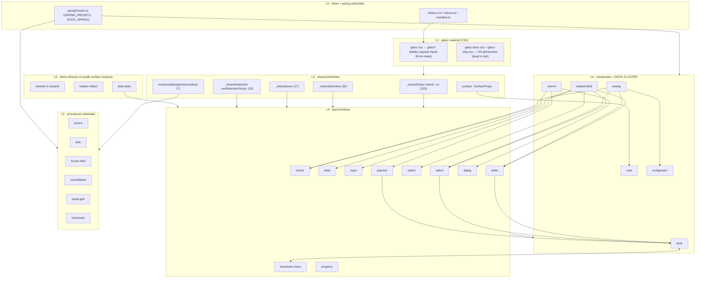

# BJ — Fable perfected DAG + reduction judgment (family C · A05)

**Mode:** TRANCHE-DEVELOPMENT. This doc is the only artifact this seat writes; no `src/` touch,
no commit. It elevates the round-1/round-2 component-DAG *census* (a mechanical import count) to a
Fable-grade design judgment for the distillation, modularization, and colocation of the library —
grounded in the real dependency edges read on disk at HEAD (`55f5170d`), not in the digest's prose.

**What "grounded on disk" means here:** every layer edge, hub fanout, and cycle below was re-derived
by grepping the actual `import` statements in `src/components/**` and `src/composables/**`, not
copied from the census. Where the on-disk edges contradict a drafted-band claim, the contradiction is
an **AMENDMENT** (§4), never a silent divergence.

---

## 1. The true component DAG, distilled

The census counted props and consumers. It did not draw the dependency graph. Read from the imports,
the 7.0.0 tree is a clean six-layer stack with **one real cycle** and **one shared-context hub that
sits in the wrong layer**. Everything else is acyclic.

### 1.1 The layers (authority → surface)

**L0 — Token & spring authorities (source-of-record; import nothing above).**
- `src/styles/tokens.css` → `tokens/*` partials — the CSS custom-property source-of-record (color,
  easing, glass rungs, paper, shadow, sizing). `tokens/scheme-spring.css` is the CSS spring-token arm.
- `src/styles/tokens.ts` + `src/styles/tokens/manifest.ts` — the TS token manifest.
- `src/composables/motion/spring/springPresets.ts` — the JS spring authority: `SPRING_PRESETS` +
  `springPreset(name)` (`:65`, `:125`) + the `DOCK_SPRING` register. Consumed across `motion/morph`,
  `motion/spring`, `motion/reveal`.
- `src/styles/typography.css`, `theme.css` (`@theme` Tailwind aliases, reads L0 tokens).

**L1 — Glass material authorities (CSS; consume L0).**
- `src/styles/glass.css` — thin `@import` root over 18 `glass/*` partials in cascade order
  (`material, ladder, ladder-undershadow, grain-overlay, accent-tone, rim, surfaces, surfaces-pager,
  control-surfaces, glass-capsule, liquid-fill, surface-axis, material-roles, reveal, liquid-enter,
  deep, defined, squircle` — `glass.css:46-107`). This is the 5-rung ladder + the capsule + the
  `liquid-fill` track substrate.
- **Dead in this layer (shipping defect, already family-G born-RED):** `glass/glass-atom.css` AND
  `glass/glass-chip.css` are **both** absent from every `@import` root (verified: not in `glass.css`,
  not in `index.css`). The census/R3a fold named "chip"; on disk it is chip **and** atom.

**L2 — Shared component primitives (`_shared/` leaves + `surface/` + the composable domains).** This
is the real hub layer; the fanouts (measured on disk) are:

| leaf | consumers | role |
|---|---|---|
| `_shared/class-names.ts` (`cn`) | **133** | universal className merge — THE hub |
| `_shared/primitive.ts` | **50** | Primitive/Slot render base |
| `_shared/axes.ts` | **27** (also public `/axes`) | the grammar axis types (`Size/Surface/Motion/…`) |
| `_shared/selection.ts` | **20** | `useSelectionGroup` — the ONE roving-focus/indicator engine |
| `_shared/floating.ts` | 8 | reka floating-config shared shape |
| `_shared/interaction.ts` | 7 | pointer/press interaction axis |
| `_shared/{resolveSurfaceClass,useMotionAxis,fieldControl,feedback,control-size}` | 4-6 each | cohesion leaves |
| `surface/` (`SurfaceProps` + `Surface.vue`) | Card + Surface (+ header-ribbon renders it) | the surface-axis authority |

  Plus the composable domains, each an authority for its cluster: `composables/glass/procedural`
  (7 consumers — aurora/blob/fourier/constellation/liquid-grid), `composables/glass/{webgl,webgpu,
  wave,specular,backdropLuminance}`, `composables/motion/{spring,morph,scroll,reveal,pointer}`,
  `composables/color` (3 — the value.js quarantine leaf), `composables/{reactive,dom,dark,keyboard,
  context,sidebar}`.

  **Critical structural fact:** all of these are imported **by their leaf path**
  (`from "../_shared/primitive"`, `from "../_shared/selection"`), NOT via `_shared/index.ts` — which
  re-exports **only** `controlSizeClass` (`_shared/index.ts:1-2`). The `_shared` barrel is near-dead.

**L3 — Leaf primitives (reka-wrapped atoms + house atoms; consume L1/L2 + reka-ui).** button, label,
badge, chip, checkbox, switch, radio-group, separator, skeleton, status-dot, avatar, input, textarea,
progress, pulse, tooltip, dialog, drawer, popover, dropdown-menu, select, command, combobox, tabs,
carousel, pager-dots, accordion, collapsible, toast, toggle-group, number-field, status. These are the
keep-core; most have exactly one component-file + `types.ts`.

**L4 — Composites (import sibling components).** The real component→component edges on disk:
```
labeled-field → input, label, select, slider, switch      card → surface
carousel → button      number-field → button               data-table → skeleton, table
search → badge, button, dialog, popover                    command → combobox, dialog
tabs → select, tooltip     tags-input → chip                deck → pager-dots     timeline → popover
configurator → fading-scroll, label     easing → button, configurator, select, slider
  ── THE DOCK CLUSTER (hub + cycle) ──
dock  ⇄  dropdown-menu           (2-CYCLE, see §1.3)
slider → dock/composables/dockContext + useDockHold
select → dock/composables/dockContext        popover → dock/composables/dockContext
```

**L5 — Procedural substrate components (WebGL/WebGPU-bearing; consume L2 `glass/procedural`).**
aurora, blob, fourier-field, constellation, liquid-grid, handmark, watercolor-dot, paper-backdrop.

**L6 — Demo-devices sitting on the public surface (the reduction targets, not a real layer).**
configurator, easing, data-table, liquid-grid, timeline, header-ribbon — components whose only real
consumers are the demo shell or a single external repo. Their presence on the public surface (and, for
two of them, on the **root barrel**) is the F04 surface to abrogate.

### 1.2 Load-bearing hubs / leaves

- **Hubs (removing or moving them ripples widely):** `_shared/class-names` (133), `_shared/primitive`
  (50), `_shared/axes` (27), `_shared/selection` (20), `surface` (surface-axis), `dock/composables/
  dockContext` (4 cross-family consumers), `composables/glass/procedural` (7), `springPresets.ts`.
- **True leaves (safe to touch in isolation):** the L5 procedural components each import DOWN only;
  the L6 demo-devices are imported by nobody in `src/` except each other (easing→configurator).

### 1.3 Cycles / near-cycles

- **`dock ⇄ dropdown-menu` — a real 2-cycle.** `dock/DockTrigger.vue:11` imports
  `dropdown-menu/DropdownMenuTrigger.vue`; `dropdown-menu/DropdownMenuContent.vue:11` imports
  `dock/composables/dockContext`. This is structural, not incidental — the dock composes a dropdown as
  a trigger while the dropdown reads dock context to know it lives in a dock.
- **`dockContext` fan-in from unrelated families.** `slider/Slider.vue:12`, `select/SelectContent.vue:32`,
  `popover/Popover.vue:8`, `popover/PopoverContent.vue:13` all import `dock/composables/dockContext`
  (`useOptionalDockContext`). A form primitive and two overlay primitives depend on a *chrome
  component's* internal composable. This is the actual coupling the census attributed only to Slider's
  `keepDockOpen` prop — the prop is a symptom; the import edge is the leak (§4-A3).

### 1.4 The reference DAG (mermaid)



---

## 2. Distillation verdict per roster member

Every component the REDUCTION band or ASK-REDUCTION touches, with a Fable-grade verdict grounded in
the on-disk edges. Rows already routed to the user by ASK-REDUCTION are marked **ASK** and only
*sharpened* — not re-absorbed. Where I differ from the drafted band, the differ is flagged `[Δ→§4]`.

### KEEP (load-bearing; thin the surface, keep the component)

- **Card** — KEEP; neutralize defaults + collapse axes. Verified live on disk: `Card.vue:33` `grain: true`,
  `Card.vue:39` `metal: "gold"` (the census cited `:33,:38` — metal is `:39`, minor drift). The gold+grain
  default is the direct F04 shape. **Differ `[Δ→§4-A5]`:** the one-axis target must **retain `surface`**
  (the surface-axis is a real L2 authority — `SurfaceProps` + `_shared/axes`, 27 consumers), collapsing
  only `material/tier` + the 5 dead decorative flags. The band's OPEN leans "single `variant` role-axis";
  dropping `surface` would sever a shared authority.
- **Typewriter** — KEEP; retire the 11 zero-setter typo-model knobs behind one `humanize` default. The 20-prop
  surface is a single-consumer leaf (only `demo/stories/motion/typewriter.vue`); zero cross-`src` edges — a
  clean thin.
- **GlassDock** — KEEP (it is an L4 **hub**, not a leaf). Retire the dead `position` axis + `autoLuminance/
  containerName/viewTransitionName`. **Guard:** the cut must not disturb `dock/composables/dockContext` — 4
  external families depend on it (§1.3). This routes into GF-DOCK, which owns the shape.
- **Slider** — KEEP; retire `keepDockOpen`. The reroute target already exists: `Slider.vue:12` already imports
  `useOptionalDockContext` beside `useDockHold` (`:13`), and select/popover already consume the same context.
  So "move the hold to context" is **adopting an existing authority**, not minting one `[Δ→§4-A3]`.
- **Labeled\* family** (LabeledField/Input/Select/Slider/Switch) — KEEP as slot-forwarders; retire the 7/12
  duplicated validation/layout props. The family imports its inner controls (`labeled-field → input/label/
  select/slider/switch`), so it is a genuine L4 wrapper — thin it, do not delete it. Gate `invalid`/`errorLive`
  on BAND-A11Y (the auto `for`/`id` binding is a Q051 fold row).
- **Progress** — KEEP; drop the two `getValue*` reka passthroughs. Confirmed the census correction: `as`/`asChild`
  are NOT in `progress/types.ts` at HEAD (stale round-1 claim — do not chase). Track-family DRY (F23) is family-F.
- **AnimatedDigit** — KEEP; retire `digitCount/mode/damping` to defaults.
- **HandMark** — KEEP; target surface (≈8 props) DELIVERED by the GF-HANDMARK greenfield, not cut here. Note
  `handmark/` has 6 loose helpers colocated by BAND-COLOCATION Move D — the greenfield and the colocation must
  not both rewrite the same imports (name the seam in GF-HANDMARK).
- **DialogContent (`stage` axis)** — KEEP/defer. Do not cut here; the stage axis is coupled to the graded-backdrop
  `--glass-halo-*` cohort whose adopt/retire is BAND-MATERIAL W3. The `placement.css` sheet-fold ships from
  `index.css:225` — the dialog is already the sheet successor, so the axis carries real structural load.
- **header-ribbon** — KEEP. Round-1 called it a "prime delete"; round-2 REFUTED it — `keyframes.js
  EditorShell.vue:116` imports it (undeclared consumer) and `MIGRATION.md:115` marks it KEPT. Do not sentence it.

### DELETE (dead / zero-consumer; evidence on record)

- **`fourier-field/presets.ts`** — DELETE. 0 importers on disk (`grep 'from "./presets"' = 0`); diverges from
  the live `DEFAULT_FOURIER_CONFIG`; presets-in-consumers violation. Born-RED reach probe.
- **liquid-grid** (component + export + story page) — DELETE. RULED (ADJUDICATION-1 R1): zero consumers anywhere.
  Owns the StoryHero suffuse re-home. Note it is an L5 procedural component whose only edge is `glass/wave` (which
  BAND-COLOCATION Move A folds into liquid-grid the same tranche — if liquid-grid is deleted, `glass/wave` has NO
  home and is deleted too; **the two waves must sequence: delete supersedes the move** — name the seam).
- **useStagger** — DELETE (pending census). `core/index.ts:16` claims "external consumers" with no evidence doc;
  in-repo usage is a unit test only. Run the family-B census; retire if unbacked (no certification on a comment).

### MERGE-INTO / demo-privatize (survives, off the public surface)

- **Configurator → `demo/`** — demo-device (382 LOC; consumers are `VizStudio.vue` + `configurator.vue` only).
  **Differ `[Δ→§4-A9]`:** the band says "drop the `./configurator` export" but Configurator is ALSO re-exported on
  the **root barrel** (`src/index.ts:141 export * from "./components/configurator"`). Demo-privatizing it is a
  ROOT-barrel break, not just a subpath drop — remove line 141 too, or the barrel dangles.
- **compositions demo section → delete** (6 pages) — decided-delete with the confirm-preset test re-home
  (`dialog.confirm-preset.test.ts:7` imports `GatePatternStory`). The *whole-section-vs-keep-one* taxonomy call is
  ASK §D1 — sharpened below.

### ASK (genuinely the user's call — sharpened, not re-decided)

These stay routed to ASK-REDUCTION; I sharpen the statement, I do not absorb the decision.

- **A1 metric-family + instrument-chassis** — the flagship third-ask. Sharpen with the on-disk fact the ASK omits:
  `metric/MetricRow.vue` is PRESENT and on `/metric` (`metric/index.ts`), consumed by `demo/stories/data/
  {instrument-chassis,metric}.vue` — the `/metric` surface is Metric+Cell+Row+Stack, not the three the ASK names.
  Any relay must census `/metric` as a 4-symbol surface. Recommendation on record stands: RATIFY SHARED-KEEP.
- **A2 completion-seal** — provenance corrected (sci-report×2 + atlas×2, NOT speedtest). Sharpen: it is on the
  root cascade (`index.css:237`) as a shipped visual partial — retiring it is a CSS-cascade edit, not only a
  component delete. Borderline KEEP by the ≥2 bar.
- **B1 DataTable** — sharpen: like Configurator, DataTable is on the **root barrel** (`src/index.ts:91`), so
  demo-privatizing it is a root-barrel break. 458 LOC, one consumer. Thin-or-privatize is the user's; the ARIA-index
  surface is BAND-A11Y's if kept.
- **B2 FourierField / B3 Constellation** — L5 procedural leaves, dead physics knobs, 0 external consumers. Retire
  knobs regardless; keep-vs-relocate is the user's. If relocated, both leave the L5 public set with liquid-grid.
- **B4 easing** — demo-device (easing→configurator/button/select/slider). Public-surface drop is the user's; F31
  owns the curve-component redesign. Note easing depends on Configurator, so their dispositions couple.
- **B5 WatercolorDot** — single external (value.js). Relocate-vs-keep is the user's; retire dead knobs regardless.
- **C1 deck vs carousel** — `deck/index.ts` exports a headless engine (`useDeck`/`DeckCore`), consumed by atlas×2;
  carousel is the visual component (`carousel → button`). They are NOT duplicates at the API atlas consumes. Keep
  deck-as-engine; collapse only any visual overlap.
- **C2 confirm-dialog** — component fold already landed 7.0.0; only the demo STORY-page keep-or-fold remains.
- **C3 reveal/scroll · C4 tempo** — demo-page consolidation calls; `fading-scroll` is the confirmed ≥2 keep.
- **D1 compositions** — whole-section prune vs keep-one-as-`scene`. Sharpened cross-ref stands: pruning empties the
  `scene` type → taxonomy is 6 (do not mint an empty type).

**Verdict tally:** KEEP 10 · DELETE 3 · MERGE-INTO/demo-privatize 2 · ASK 12 (unchanged from ASK-REDUCTION;
sharpened only).

---

## 3. The modularization design

### 3.1 Principles

1. **A shared substrate is real iff ≥2 *distinct-family* consumers reach it.** Single-family fan-in is
   incidental colocation debt (colocate into the owner). Multi-family fan-in is a real authority (keep central).
2. **Fanout, not folder, decides the home.** A high-fanout leaf (`cn` 133, `primitive` 50, `axes` 27,
   `selection` 20) stays at the flat `_shared/` root — carving it into a sub-submodule buys zero cohesion and
   costs one path-rewrite per consumer, because consumers import the *leaf*, not the barrel.
3. **Authorities import DOWN only.** L0/L1/L2 must never import a component. The one violation to resolve is
   `dockContext` living inside `dock/` while slider/select/popover import UP into it (§3.3).
4. **Dead ≠ incidental.** Un-`@imported` partials (glass-atom, glass-chip) and 0-importer files (presets.ts,
   the 5 barrels) are deletions, not relocations.

### 3.2 Real shared substrates (keep central) vs incidental (colocate)

| substrate | consumers | verdict |
|---|---|---|
| `_shared/class-names·cn` | 133 (all families) | REAL — root, universal |
| `_shared/primitive` · `axes` · `selection` | 50 · 27 · 20 (multi-family) | REAL — root; do NOT carve `[Δ→§4-A1]` |
| `surface/` (`SurfaceProps`) | Card + surface-axis | REAL — the surface authority |
| `dock/composables/dockContext` | 4 (slider·select·popover·dropdown) | REAL but MIS-HOMED (§3.3) |
| `composables/glass/procedural` · `color` | 7 · 3 | REAL — module-level, whitelisted |
| `springPresets.ts` + `scheme-spring.css` | motion cluster + CSS | REAL — the spring authorities |
| `glass/{ladder,capsule,liquid-fill,rim,deep}` | universal | REAL — L1 material |
| `_shared/{menu,feedback-tone}.css`, `glass-capsule.css`, `surfaces-pager.css` | ≥2 families | REAL — central register |
| `glass/wave` → liquid-grid | 1 (dies with liquid-grid) | INCIDENTAL/dead |
| `glass/textureUpload` → aurora | 1 | INCIDENTAL — colocate (COLOCATION Move B) |
| `glass/accent-tone.css` → chip | 1 family | INCIDENTAL — colocate (COLOCATION Move C) |
| `handmark/` 6 loose helpers | 1 | INCIDENTAL — colocate (COLOCATION Move D) |
| `_shared/` feedback/disclosure/field cohesion clusters | low fanout, single-cohesion | carve into submodules (COLOCATION Carve E) — OK |
| `glass-atom.css` + `glass-chip.css` | 0 (un-`@imported`) | DEAD — family-G fix, not a move |

### 3.3 The concrete target module tree (after reduction + colocation)

- `_shared/` root keeps: `index.ts, class-names.ts, axes.ts, floating.ts, primitive.ts, selection.ts` (the
  high-fanout multi-family primitives). Carve ONLY the genuine low-fanout cohesion clusters
  (`feedback/`, `disclosure/`, `field/`, `menu/`) — this is BAND-COLOCATION Carve E **minus primitive/selection**
  (§4-A1).
- `dockContext` — the one open home question. It is a real 4-family authority but lives inside `dock/`, forcing a
  form primitive to import a chrome component. Two honest options: **(a)** accept dock as a peer authority and
  whitelist the edge (KISS, no move), or **(b)** promote `dockContext` to `composables/context/` (a neutral home)
  so slider/select/popover import sideways, not up. Recommend (a) for this tranche (the edge is stable and the
  greenfield owns dock) and record (b) as the principled target. This is a design call, not a wave-mechanics call.
- L5 procedural set contracts by whatever B2/B3/B5 rule (fourier-field/constellation/watercolor-dot) + the
  liquid-grid delete.
- L6 empties: configurator/easing/data-table demo-privatized (per B1/B4 + Wave 3), timeline redesigned (F16),
  header-ribbon KEEPS (refuted delete).

### 3.4 The seam with BAND-COLOCATION

BAND-COLOCATION owns the **structural moves** (wave, textureUpload, accent-tone, handmark, `_shared` carve,
the 5 barrels, sidebar demote). BAND-REDUCTION owns the **surface cuts** (props, deletes, demo-privatize). This
doc is the **judgment layer** over both: it ratifies the moves that match a real cohesion boundary, and it names
three seams where the two bands collide on the same files — (1) `_shared` carve over-reaches on primitive/selection
(§4-A1); (2) `glass/wave` move vs liquid-grid delete must sequence delete-first (§2 DELETE); (3) `handmark`
colocation vs the GF-HANDMARK greenfield must not both rewrite the same imports. No duplication of COLOCATION's
move mechanics — only the boundary judgment and the collision seams.

---

## 4. Numbered amendments (appendable verbatim)

**A1 — to BAND-COLOCATION Carve E (and cited by BAND-REDUCTION as the modularization boundary).** Remove
`primitive.ts` (50 consumers) and `selection.ts` (20 consumers) from the `_shared/` carve; keep both at
`_shared/` root beside `class-names.ts` and `axes.ts`. The band's blast-radius estimate — "intra-dir + 3 `@import`
lines" — is wrong for these two: `_shared/index.ts` re-exports ONLY `controlSizeClass` (`_shared/index.ts:1-2`), so
every consumer imports the leaf path directly (`from "../_shared/primitive"`), and moving the leaf rewrites all 50 /
20 import sites. Carving a 50-fanout multi-family primitive into a sub-submodule is pure churn with zero cohesion
gain; carve only the genuine low-fanout single-cohesion clusters (feedback/disclosure/field/menu).

**A2 — to BAND-REDUCTION Wave 5 (F16 timeline).** The stub treats timeline as a single component (the speedtest
`PhaseTimeline` consumer). On disk `timeline/` is a **five-variant family** — `ContinuousRail.vue` (214),
`ContinuousTimeline.vue` (349), `GlassTimeline.vue` (232), `ScrubberTimeline.vue` (413), `SegmentedTimeline.vue`
(292) = ~1500 LOC. The variant proliferation IS the overfit F16 names; the ground-up redesign must scope
consolidation of all five into one timeline, not "redesign a component." Name the five in the stub so none silently
survives the redesign.

**A3 — to BAND-REDUCTION Wave 1 (Slider `keepDockOpen`).** State that the leak is the import edge
`slider → dock/composables/{dockContext,useDockHold}`, and that the reroute is *adoption of an existing authority*:
`Slider.vue:12-13` already imports `useOptionalDockContext` + `useDockHold`, and select/popover/dropdown-menu
already consume the same `dockContext`. So "move the hold to context" mints nothing new and is low-risk — the prop
is the symptom, the shared context already carries the mechanism. Retiring the prop leaves the (legitimate) context
edge intact.

**A4 — to BAND-REDUCTION band-framing (structural record) + GF-DOCK.** Record the `dock ⇄ dropdown-menu` 2-cycle
(`dock/DockTrigger.vue:11` ↔ `dropdown-menu/DropdownMenuContent.vue:11`) and the `dockContext` 4-family fan-in as
a structural fact feeding GF-DOCK. Dock is an L4 hub, not a leaf; the "retire the dead `position` axis" cut must be
proven not to disturb `dockContext` (a null-DELTA on the four consuming families' stories).

**A5 — to BAND-REDUCTION Wave 2 (Card axis-collapse OPEN).** Resolve the "variant alone vs variant+surface" OPEN
toward **variant + surface**: `surface` is a real L2 authority (`SurfaceProps` extends into Card; `_shared/axes`
`Surface` type has 27 consumers), so collapsing it away severs a shared axis. Collapse `material` + `tier` + the 5
decorative flags (metal/grid/deep/specular/dataHueStrength) only; keep `variant` (role) + `surface` (material-family)
as the two-axis floor.

**A6 — to the family-G orphan-partial fix wave (cited from BAND-REDUCTION/COLOCATION).** The dead-in-dist orphan is
`glass/glass-chip.css` AND `glass/glass-atom.css` — BOTH are absent from every `@import` root (verified against
`glass.css:46-107` and `index.css`). The census/R3a fold named chip only; the fix wave must `@import` both (or fold
both into the live partials).

**A7 — to BAND-REDUCTION Wave 4 / ASK §A1 (metric census accuracy).** The `/metric` public surface is a 4-symbol
family — `Metric`, `MetricCell`, `MetricRow`, `MetricStack` (`metric/index.ts`; `MetricRow.vue` present, consumed by
`demo/stories/data/{instrument-chassis,metric}.vue`). Any SHARED-KEEP ratification or relay must census all four,
not the three the ASK enumerates.

**A8 — to BAND-REDUCTION Wave 3 (Configurator + DataTable root-barrel break).** Configurator (`src/index.ts:141`)
AND DataTable (`src/index.ts:91`) are re-exported on the **root barrel**, not only via subpath. Demo-privatizing or
dropping either must delete the root-barrel `export *` line too; the band's "drop the `./configurator` export"
undercounts the surface break. (DataTable is ASK §B1 — this applies if the user rules privatize.)

---

## 5. Perfection check — what only reading the code reveals

Ten findings the prop-and-consumer census structurally could not surface (each cited to disk):

1. **The `_shared` barrel is near-dead.** `_shared/index.ts:1-2` re-exports ONLY `controlSizeClass`; the 133/50/27/20
   consumers of cn/primitive/axes/selection all import leaf paths. COLOCATION's "keep the barrel stable → consumers
   unaffected" is false for every carved leaf (→ A1).
2. **`dock ⇄ dropdown-menu` is a real 2-cycle** (`dock/DockTrigger.vue:11` ↔ `dropdown-menu/DropdownMenuContent.vue:11`)
   — the census's flat DAG showed no cycles (→ A4).
3. **`dockContext` is a 4-family authority mis-homed inside `dock/`** (`slider/Slider.vue:12`, `select/SelectContent.vue:32`,
   `popover/Popover.vue:8`, `popover/PopoverContent.vue:13`). The coupling the census pinned on Slider's *prop* is an
   *import edge* shared by three families (→ A3, §3.3).
4. **Timeline is 5 variants ~1500 LOC**, not one component — F16's undercount (`wc -l timeline/*.vue`) (→ A2).
5. **Both `glass-atom.css` and `glass-chip.css` are un-`@imported`** (dead in dist), not chip alone (`glass.css:46-107`;
   `index.css` — neither appears) (→ A6).
6. **Card's live defaults are `grain:true` (`Card.vue:33`) + `metal:"gold"` (`Card.vue:39`)** — confirmed on disk; the
   census cited `:38` for metal (it is `:39`), a harmless drift but worth pinning before the paint gate.
7. **`MetricRow.vue` exists on `/metric`** (`metric/index.ts`) and is unaccounted in the band's metric census, which
   names only badge/cell/stack (→ A7).
8. **Slider already imports the context substrate** the band wants to route through (`Slider.vue:12-13`) — the reroute
   adopts an existing authority, de-risking Wave 1 (→ A3).
9. **`Surface.vue` is barely a rendered component** — `SurfaceProps` is consumed by Card + Surface only, and only
   header-ribbon renders `<Surface>`. It is a props/axis authority more than a component; relevant to whether `/surface`
   stays a public subpath or folds into the axis types.
10. **Configurator (`src/index.ts:141`) and DataTable (`src/index.ts:91`) are on the ROOT barrel** — demo-privatizing
    either is a root-barrel break the band's "drop the subpath export" scope misses (→ A8).

---

## 6. Standing-ruling check

No amendment above contradicts a standing ruling. ADJUDICATION-1 R1 (liquid-grid DELETE), CHRONIC-ADJUDICATION R14/R16
(completion-seal / metric-badge), and the ASK-REDUCTION user routing are all preserved — the ASK rows are sharpened,
never re-decided; every DELETE cited was already ruled; every KEEP matches the round-2 corrected consumer truth. The
one place I differ from a drafted band (COLOCATION Carve E, Card axis OPEN, F16 scope, root-barrel breaks) is an
`OPEN:`/recommendation-level judgment, not a terminal ruling — surfaced as amendments A1/A2/A5/A8 for the two-challenge
pass to adopt.
