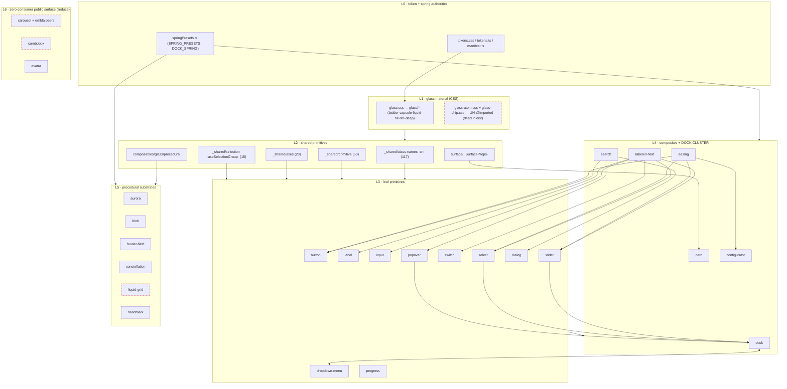

# BJ — Fable perfected DAG + reduction judgment (family C · A05)

**Verified-model:** this document was REWRITTEN 2026-07-18 by a true Fable seat (`claude-fable-5`,
REFABLE unit RU-12). The prior version was opus-begat (`claude-opus-4-8` via the settings-level
subagent override, census row RU-12).
**Union provenance:** rebuilt per the REFABLE protocol — ANEW analysis from primary sources first
(src/ in full, demo/, the deterministic component-graph.json at c12beecb, FEEDBACK-LEDGER rows,
live-code greps across all 11 sibling repos), then the opus artifact scrutinized claim-by-claim;
opus content survives below only where RATIFIED on disk; every corrected or new row is marked.
Verdict sidecar: `../refable/REFABLE-RU-12.md`.

**Mode:** TRANCHE-DEVELOPMENT. This doc is the only artifact this seat writes; no `src/` touch,
no commit. It elevates the component-DAG census to the design judgment for the distillation,
modularization, and reduction of the library — grounded in the real dependency edges read on disk
at HEAD (55f5170d..HEAD carries zero `src/` commits; the tree judged is the current tree).

**External-consumer ground truth (the live-code census this doc stands on):** imports were re-swept
across atlas, slides, speedtest, bbnf-buddy, keyframes.js, sci-report, value.js (src+demo),
fourier-analysis (web/src), oscilloscope — live `.vue`/`.ts` imports only; docs/research files and
comment mentions are NOT consumers (the comment-mistaken-for-consumer class recurs and is fenced
here). Stale-name subpaths (`hover-card`, `sheet`, `metric-badge`, `pagination`, `toggle-chip`,
`glass-panel`) mark consumers pinned on old versions; per the consumer-updates ruling they preserve
nothing.

---

## 1. The true component DAG, distilled

Read from the imports, the 7.0.0 tree is a clean six-layer stack with **one real cycle** and **one
shared-context hub that sits in the wrong layer**. Everything else is acyclic.

### 1.1 The layers (authority → surface)

**L0 — Token & spring authorities (source-of-record; import nothing above).**
- `src/styles/tokens.css` → `tokens/*` partials — the CSS custom-property source-of-record.
  `tokens/scheme-spring.css` is the CSS spring-token arm.
- `src/styles/tokens.ts` + `src/styles/tokens/manifest.ts` — the TS token manifest.
- `src/composables/motion/spring/springPresets.ts` — the JS spring authority (`SPRING_PRESETS` +
  `springPreset(name)` + `DOCK_SPRING`). Consumed across `motion/morph`, `motion/spring`,
  `motion/reveal`, dock, and demo motion stories (13 importing files).
- `src/styles/typography.css`, `theme.css`.

**L1 — Glass material authorities (CSS; consume L0).**
- `src/styles/glass.css` — thin `@import` root over the `glass/*` partials in cascade order.
- **Dead in this layer (shipping defect, family-G born-RED):** `glass/glass-atom.css` AND
  `glass/glass-chip.css` are **both** absent from every `@import` root (re-verified: not in
  `glass.css`, not in `index.css`; the only mentions are comments in `glass-capsule.css` and
  `liquid-fill.css`).

**L2 — Shared component primitives (`_shared/` leaves + `surface/` + the composable domains).**
The fanouts, re-measured (files importing the leaf path; src / src+demo):

| leaf | consumers | role |
|---|---|---|
| `_shared/class-names.ts` (`cn`) | **117** src (151 with demo) | universal className merge — THE hub |
| `_shared/primitive.ts` | **50** | Primitive/Slot render base |
| `_shared/axes.ts` | **28** (also public `/axes`) | the grammar axis types |
| `_shared/selection.ts` | **15** | `useSelectionGroup` — the ONE roving-focus/indicator engine |
| `_shared/floating.ts` | 8 | reka floating-config shared shape |
| `_shared/interaction.ts` | 7 | pointer/press interaction axis |
| `_shared/{resolveSurfaceClass,useMotionAxis,fieldControl,feedback,control-size,valueDomain}` | 2-6 each | cohesion leaves |
| `surface/` (`SurfaceProps` + `Surface.vue`) | Card + Surface (+ header-ribbon renders it) | the surface-axis authority |

  (The opus draft's 133/27/20 figures were imprecise; the corrected counts above do not change any
  A1 conclusion — primitive/selection remain high-fanout multi-family leaf-path imports.)

  Plus the composable domains, each an authority for its cluster: `composables/glass/procedural`,
  `composables/glass/{webgl,webgpu,wave,specular,backdropLuminance}`,
  `composables/motion/{core,spring,morph,scroll,reveal,pointer,number}`, `composables/color`,
  `composables/{reactive,dom,dark,keyboard,context,sidebar}`.

  **Critical structural fact (RATIFIED):** all of these are imported **by their leaf path**, NOT via
  `_shared/index.ts` — which re-exports **only** `controlSizeClass` (`_shared/index.ts:1-2`). The
  `_shared` barrel is near-dead.

**L3 — Leaf primitives (reka-wrapped atoms + house atoms; consume L1/L2 + reka-ui).** button, label,
badge, chip, checkbox, switch, radio-group, separator, skeleton, status-dot, avatar, input, textarea,
progress, pulse, tooltip, dialog, drawer, popover, dropdown-menu, select, command, combobox, tabs,
carousel, pager-dots, accordion, collapsible, toast, toggle-group, number-field. Most are keep-core;
the zero-consumer members (combobox, carousel — §2) are not.

**L4 — Composites (import sibling components).** The real component→component edges on disk (all
re-verified):
```
labeled-field → input, label, select, slider, switch      card → surface
carousel → button      number-field → button               data-table → skeleton, table
search → badge, button, dialog, popover                    command → combobox/types (TYPE-only)
tabs → select, tooltip     tags-input → chip                deck → pager-dots     timeline → popover
configurator → fading-scroll, label     easing → button, configurator, select, slider
  ── THE DOCK CLUSTER (hub + cycle) ──
dock  ⇄  dropdown-menu           (2-CYCLE, see §1.3)
slider → dock/composables/dockContext + useDockHold
select → dock/composables/dockContext        popover → dock/composables/dockContext
```
(The opus draft's `command → combobox, dialog` edge is half-right: command imports ONLY
`combobox/types` — type-only, six files — and wraps the reka Combobox substrate directly. The SFC
families do not compose. See A9.)

**L5 — Procedural substrate components (WebGL/WebGPU-bearing; consume L2 `glass/procedural`).**
aurora, blob, fourier-field, constellation, liquid-grid, handmark, watercolor-dot, paper-backdrop.
External truth: aurora (atlas·keyframes.js·speedtest·value.js), constellation (atlas·slides),
fourier-field (slides), blob (value.js), handmark (atlas), watercolor-dot (value.js),
paper-backdrop (atlas·speedtest), liquid-grid (ZERO — the ruled delete).

**L6 — Demo-devices sitting on the public surface.** The opus draft filed configurator, easing,
data-table, timeline, header-ribbon here. The live census REFUTES the framing for most of them:
configurator (value.js + fourier-analysis), easing (keyframes.js + value.js), data-table
(atlas + speedtest), timeline (speedtest), header-ribbon (keyframes.js) all have live external
consumers. The true L6 set — public surface with zero live consumers anywhere — is: **carousel,
combobox, avatar, liquid-grid, the search FuzzySearch SFC, and the zero-consumer motion leaves
(§2 DELETE / §4 A9-A14)**.

### 1.2 Load-bearing hubs / leaves

- **Hubs:** `_shared/class-names` (117), `_shared/primitive` (50), `_shared/axes` (28),
  `_shared/selection` (15), `surface/`, `dock/composables/dockContext` (5 importing files across
  4 families), `composables/glass/procedural`, `springPresets.ts`.
- **True leaves (safe to touch in isolation):** the L5 procedural components each import DOWN only;
  the zero-consumer set (§1.1 L6) is imported by nobody in `src/` except easing→configurator.

### 1.3 Cycles / near-cycles (RATIFIED on disk)

- **`dock ⇄ dropdown-menu` — a real 2-cycle.** `dock/DockTrigger.vue:11` imports
  `dropdown-menu/DropdownMenuTrigger.vue`; `dropdown-menu/DropdownMenuContent.vue:11` imports
  `dock/composables/dockContext`. Structural, not incidental.
- **`dockContext` fan-in from unrelated families.** `slider/Slider.vue:12`,
  `select/SelectContent.vue:32`, `popover/Popover.vue:8`, `popover/PopoverContent.vue:13`,
  `dropdown-menu/DropdownMenuContent.vue:11` all import `useOptionalDockContext`. A form primitive
  and two overlay primitives depend on a chrome component's internal composable — the import edge
  is the leak, the `keepDockOpen` prop only its symptom (§4-A3).

### 1.4 The reference DAG (mermaid)



---

## 2. Distillation verdict per roster member

Every component the REDUCTION band or ASK-REDUCTION touches. Rows already routed to the user by
ASK-REDUCTION are marked **ASK** and only *sharpened* — not re-absorbed. `[RATIFIED]` = the opus
verdict re-proven; `[CORRECTED]` = the opus premise or verdict overturned by the live census;
`[FABLE-NEW]` = absent from the opus draft.

### KEEP (load-bearing; thin the surface, keep the component)

- **Card** `[RATIFIED]` — KEEP; neutralize defaults + collapse axes. Live on disk: `Card.vue:33`
  `grain: true`, `Card.vue:39` `metal: "gold"` — the direct F04 shape. The one-axis target must
  **retain `surface`** (a real L2 authority; `_shared/axes` has 28 consumers) — §4-A5.
- **Typewriter** `[CORRECTED]` — KEEP; retire the zero-setter typo-model knobs behind one `humanize`
  default. The opus draft called it a single-consumer demo leaf; **atlas live-consumes
  `/typewriter`** — the thin stands, the consumer fact is corrected (the thin must not break the
  atlas call sites; consumer-updates addendum if the surface shifts).
- **GlassDock** `[RATIFIED]` — KEEP (an L4 hub, not a leaf). The cut must not disturb
  `dock/composables/dockContext` — 4 external families depend on it (§1.3). Routes into GF-DOCK.
- **Slider** `[RATIFIED]` — KEEP; retire `keepDockOpen`. `Slider.vue:12-13` already imports
  `useOptionalDockContext` + `useDockHold`; the reroute adopts an existing authority (§4-A3).
- **Labeled\* family** `[RATIFIED]` — KEEP as slot-forwarders; retire the duplicated
  validation/layout props; gate `invalid`/`errorLive` on BAND-A11Y.
- **Progress** `[RATIFIED]` — KEEP; drop the two `getValue*` reka passthroughs (present in
  `progress/types.ts:12,16`; `as`/`asChild` confirmed absent). Track-family DRY (F23) is family-F;
  note the remaining copy is the value-marks span + per-mark CSS duplicated between `Progress.vue`
  and `Slider.vue` — `_shared/valueDomain` and `.glass-liquid-fill` are ALREADY shared; the marks
  fragment is the one unfinished extraction.
- **AnimatedDigit** `[RATIFIED]` — KEEP (speedtest live); retire `digitCount/mode/damping` to
  defaults.
- **HandMark** `[RATIFIED]` — KEEP; target surface DELIVERED by GF-HANDMARK; the colocation seam
  (6 loose helpers) named in GF-HANDMARK.
- **DialogContent (`stage` axis)** `[RATIFIED]` — KEEP/defer to BAND-MATERIAL W3.
- **header-ribbon** `[RATIFIED]` — KEEP. `keyframes.js demo/components/instrument/shell/
  EditorShell.vue:116` live-imports `HeaderRibbon` from `@mkbabb/glass-ui/header-ribbon`. Do not
  sentence it.
- **Configurator** `[CORRECTED — verdict overturned]` — KEEP. The opus draft demo-privatized it on
  a "VizStudio + configurator.vue only" premise; the live census finds **10 demo files AND two
  external binaries: value.js (`/configurator`) + fourier-analysis (web/src)** — the ≥2-binary bar
  is met outright. The root-barrel fact (`src/index.ts:141`) stands as A8 mechanics IF the user
  ever rules privatize; the recommendation is now KEEP.
- **easing (EasingPicker/EasingConfigurator)** `[CORRECTED — premise reversed]` — KEEP-lean.
  The opus draft filed it a demo-device; live: **keyframes.js (`/easing`) + value.js
  (`EasingPicker`, `EasingPickerValue` ×4 files)** — two external binaries. The ASK §B4
  public-surface question stays the user's, relayed WITH this census; the easing→configurator
  coupling note stands.
- **DataTable** `[CORRECTED]` — KEEP-lean. "One consumer" is false: **atlas + speedtest live**.
  Thin-or-privatize remains ASK §B1 with the corrected census; root-barrel break mechanics (A8)
  unchanged.
- **useStagger** `[CORRECTED — verdict flipped]` — KEEP. The opus row sentenced it DELETE "pending
  census; retire if unbacked." The census is now run and the claim is BACKED:
  `speedtest/src/features/speedtest/ui/ResultStack.vue:171` live-imports `useStagger` from
  `@mkbabb/glass-ui/motion-core`, plus the in-repo unit test. The dead twin is the OTHER stagger —
  see §4-A11.
- **SearchBar** `[FABLE-NEW — split verdict]` — KEEP. value.js live-imports `SearchBar` from
  `@mkbabb/glass-ui/search` in 3 files. Note `dock/index.ts:84` claims "SearchBar + its 7 search
  composables retire onto this register" — that claim is contradicted by the live consumer; route
  the doc-truth fix to BAND-DOC-TRUTH. The rest of the search family splits: see §4-A14.

### DELETE (dead / zero-consumer; evidence on record)

- **`fourier-field/presets.ts`** `[RATIFIED]` — DELETE. 0 importers (index.ts exports
  math/constants/composable only); presets-in-consumers violation.
- **liquid-grid** (component + export + story page) `[RATIFIED]` — DELETE. RULED
  (ADJUDICATION-1 R1); zero live consumers anywhere re-verified. `glass/wave` dies with it
  (liquid-grid is its only consumer — 3 import sites, all liquid-grid); the delete supersedes the
  BAND-COLOCATION Move A — name the seam.
- **combobox (the 9-SFC wrapper family)** `[FABLE-NEW]` — DELETE/FOLD, §4-A9. Zero consumers in
  src, demo (1 story), and all 11 sibling repos; command wraps the same reka Combobox substrate
  directly and shares only `combobox/types` (type-only, 6 files). One filtered-listbox family.
- **useBloomUp + bloomUpField** `[FABLE-NEW]` — DELETE, §4-A11. Mutual + barrel references only.
- **useStaggerReveal** `[FABLE-NEW]` — DELETE/FOLD into useStagger, §4-A11. Zero consumers
  anywhere (the exported /motion-core symbol included).
- **useNumericTransition + useAnimatedNumberMap + useCountup** `[FABLE-NEW]` — DELETE/FOLD,
  §4-A10. The number band is four facilities with one real consumer.
- **FuzzySearch.vue (+ searchVariants beyond SearchBar's need)** `[FABLE-NEW]` — DELETE-candidate,
  §4-A14. Demo story only; the engine and SearchBar are the keepers.

### MERGE-INTO / demo-privatize (survives, off the public surface)

- **compositions demo section → delete** (6 pages) `[RATIFIED]` — decided-delete with the
  confirm-preset test re-home (`tests/components/dialog.confirm-preset.test.ts` imports
  `GatePatternStory`). The whole-section-vs-keep-one taxonomy call is ASK §D1.
- **useScrollPin / springProjection → demo-local** `[FABLE-NEW]` — §4-A12. Each is consumed only
  by demo stories (ScrollChoreographyBody; reveal + springs).
- **sidebar subtree** `[RATIFIED with the RF-2 correction]` — the demote is BAND-COLOCATION's;
  fourier-analysis live-imports `useSidebarState` from `@mkbabb/glass-ui/sidebar` (RF-2 C5), so
  any demote runs the consumer-updates ruling, never a "no consumer" clean break.

### ASK (genuinely the user's call — sharpened, not re-decided)

- **A1 metric-family + instrument-chassis** `[RATIFIED + census widened]` — the flagship third-ask.
  The `/metric` surface is the 4-symbol family `Metric`/`MetricCell`/`MetricRow`/`MetricStack`
  (§4-A7). Live consumers: **keyframes.js (`/metric`) + sci-report + speedtest** (metric),
  speedtest (instrument-chassis). F18 is the user's REMOVE verdict; the relay must name all three
  metric consumers, not speedtest alone.
- **A2 completion-seal** `[RATIFIED]` — provenance corrected on record: **sci-report ×2 + atlas ×2,
  NOT speedtest** (F26's "belongs only in speedtest" premise is factually reversed). On the root
  cascade at `index.css:237` — retiring it is a CSS-cascade edit too. Borderline KEEP by the ≥2 bar.
- **B1 DataTable** — see KEEP row; census corrected to 2 external binaries.
- **B2 FourierField / B3 Constellation** `[CORRECTED]` — "0 external consumers" is false:
  fourier-field → slides; constellation → atlas + slides. Retire dead physics knobs regardless;
  the relocate leg of the ask dies with the corrected census.
- **B4 easing** — see KEEP row; two external binaries.
- **B5 WatercolorDot** `[RATIFIED]` — single external (value.js, 3 files). Relocate-vs-keep is the
  user's; retire dead knobs regardless.
- **C1 deck vs carousel** `[CORRECTED — decisively sharpened]` — deck exports the headless core
  (`useDeck`/`DeckCore` type/`useDeckKeyboard`/`DeckPager`-over-PagerDots), live-consumed by
  **atlas + slides** (+ sci-report research plans to consume). Carousel has **ZERO live consumers
  in all 11 sibling repos**, one demo story, and is the sole reason `embla-carousel` +
  `embla-carousel-vue` sit in package.json (deps + peers). The collapse resolves toward: keep deck
  as the ONE paging register, DELETE carousel + both embla peers; the demo story folds onto
  deck/pager-dots. Still ASK — but the evidence is no longer symmetric (§4-A16).
- **C2 confirm-dialog** `[RATIFIED]` — the component fold landed pre-7.0.0 (no ConfirmDialog in
  src); only the demo STORY-page keep-or-fold remains (F25's answer: it IS a Dialog recipe).
- **C3 reveal/scroll · C4 tempo** `[RATIFIED]` — demo-page consolidation calls; `fading-scroll` is
  the confirmed ≥2 keep (atlas + speedtest + keyframes.js).
- **D1 compositions** `[RATIFIED]` — pruning empties the `scene` type → taxonomy is 6.

**Verdict tally (union):** KEEP 15 · DELETE 7 · MERGE/demo-privatize 3 · ASK 12 (sharpened only).

---

## 3. The modularization design

### 3.1 Principles (unchanged — all four re-verified)

1. **A shared substrate is real iff ≥2 distinct-family consumers reach it.** Single-family fan-in
   is colocation debt; multi-family fan-in is an authority.
2. **Fanout, not folder, decides the home.** High-fanout leaves stay at the flat `_shared/` root —
   consumers import the leaf, not the barrel.
3. **Authorities import DOWN only.** The one violation is `dockContext` living inside `dock/`
   while slider/select/popover import UP into it (§3.3).
4. **Dead ≠ incidental.** Un-`@imported` partials and 0-importer files are deletions, not
   relocations.

### 3.2 Real shared substrates (keep central) vs incidental (colocate)

| substrate | consumers | verdict |
|---|---|---|
| `_shared/class-names·cn` | 117 src (all families) | REAL — root, universal |
| `_shared/primitive` · `axes` · `selection` | 50 · 28 · 15 (multi-family) | REAL — root; do NOT carve (A1) |
| `surface/` (`SurfaceProps`) | Card + surface-axis | REAL — the surface authority |
| `dock/composables/dockContext` | 5 files / 4 families | REAL but MIS-HOMED (§3.3) |
| `composables/glass/procedural` · `color` | multi-family · 3 | REAL — module-level |
| `springPresets.ts` + `scheme-spring.css` | motion cluster + CSS | REAL — the spring authorities |
| `glass/{ladder,capsule,liquid-fill,rim,deep}` | universal | REAL — L1 material |
| `_shared/valueDomain` | progress + slider | REAL — finish the marks extraction (F23) |
| `search/composables` (fuzzy engine) | dock (useDockSearch) + SearchBar | REAL — the keeper of the search family (A14) |
| `glass/wave` → liquid-grid | 1 (dies with liquid-grid) | INCIDENTAL/dead |
| `glass/textureUpload` → aurora | 1 family (3 files) | INCIDENTAL — colocate (COLOCATION Move B) |
| `glass/accent-tone.css` → chip | 1 family | INCIDENTAL — colocate (COLOCATION Move C) |
| `handmark/` 6 loose helpers | 1 | INCIDENTAL — colocate (COLOCATION Move D / GF-HANDMARK seam) |
| `_shared/` feedback/disclosure/field/menu clusters | low fanout | carve OK (COLOCATION Carve E minus primitive/selection) |
| `glass-atom.css` + `glass-chip.css` | 0 (un-`@imported`) | DEAD — family-G fix, not a move |

### 3.3 The concrete target module tree (after reduction + colocation)

- `_shared/` root keeps: `index.ts, class-names.ts, axes.ts, floating.ts, primitive.ts,
  selection.ts`. Carve only the genuine low-fanout cohesion clusters (A1).
- `dockContext` — the one open home question. Two honest options: **(a)** accept dock as a peer
  authority and whitelist the edge (KISS, no move); **(b)** promote `dockContext` to
  `composables/context/` so slider/select/popover import sideways. Recommend (a) for this tranche
  (GF-DOCK owns dock); record (b) as the principled target.
- The L5 procedural set contracts by the liquid-grid delete only — B2/B3/B5 keep their components
  under the corrected census (slides/atlas/value.js consumers).
- The motion tree contracts hard: `number/` collapses to `useAnimatedNumber` (A10); `reveal/`
  drops useBloomUp/bloomUpField/useStaggerReveal (A11); `scroll/` sheds the demo-local pin (+
  scene rides the A12 conditional); `spring/` sheds springProjection to demo (A12).
- The primitive band sheds combobox (A9) and — pending the C1 ask — carousel + the embla peers
  (A16).

### 3.4 The seam with BAND-COLOCATION

BAND-COLOCATION owns the **structural moves**; BAND-REDUCTION owns the **surface cuts**. The
collision seams: (1) `_shared` carve over-reach on primitive/selection (A1); (2) `glass/wave` move
vs liquid-grid delete — delete supersedes the move; (3) `handmark` colocation vs GF-HANDMARK —
name the seam; (4) the sidebar demote must run the consumer-updates ruling for fourier-analysis
(RF-2 C5).

---

## 4. Numbered amendments (appendable verbatim)

IDs A1-A8 are the opus-draft IDs, kept stable where semantics survive; A2 is marked CHANGED;
A9-A16 are NEW (Fable, RU-12). BAND-REDUCTION's adoption block cites A1-A8 and is re-touched by
the lead from the RU-12 sidecar.

**A1 — to BAND-COLOCATION Carve E** *(kept; counts corrected)*. Remove `primitive.ts` (50
consumers) and `selection.ts` (15 consumers) from the `_shared/` carve; keep both at `_shared/`
root beside `class-names.ts` (117) and `axes.ts` (28). `_shared/index.ts` re-exports ONLY
`controlSizeClass`, so every consumer imports the leaf path and a move rewrites every import site.
Carve only the low-fanout single-cohesion clusters (feedback/disclosure/field/menu).

**A2 — to BAND-REDUCTION Wave 5 (F16 timeline)** *(CHANGED: five → SIX variants; LOC corrected)*.
On disk `timeline/` is a **six-SFC family** — `ContinuousMarkers.vue` (436 — omitted by the opus
draft), `ContinuousRail.vue` (214), `ContinuousTimeline.vue` (349), `GlassTimeline.vue` (232),
`ScrubberTimeline.vue` (413), `SegmentedTimeline.vue` (292) ≈ 1936 SFC LOC (2254 with ts/css) —
while `index.ts` exports ONLY `GlassTimeline`. The variant proliferation IS the F16 overfit; the
ground-up redesign must name all six so none silently survives. Live consumer: speedtest
(`/timeline`); atlas's GlassTimeline hits are its own vendored copy, not imports.

**A3 — to BAND-REDUCTION Wave 1 (Slider `keepDockOpen`)** *(kept; RATIFIED verbatim)*. The leak is
the import edge `slider → dock/composables/{dockContext,useDockHold}`; the reroute is adoption of
an existing authority (`Slider.vue:12-13`; select/popover/dropdown-menu already consume the same
context). Retiring the prop leaves the context edge intact.

**A4 — to BAND-REDUCTION band-framing + GF-DOCK** *(kept; RATIFIED verbatim)*. Record the
`dock ⇄ dropdown-menu` 2-cycle (`dock/DockTrigger.vue:11` ↔ `dropdown-menu/DropdownMenuContent.vue:11`)
and the `dockContext` 4-family fan-in as structural facts feeding GF-DOCK; the dock cuts owe a
null-DELTA on the four consuming families' stories.

**A5 — to BAND-REDUCTION Wave 2 (Card axis-collapse OPEN)** *(kept; RATIFIED)*. Resolve toward
**variant + surface**: `surface` is a real L2 authority (28 axis consumers). Collapse `material` +
`tier` + the decorative flags; `grain:true`/`metal:"gold"` defaults (`Card.vue:33,:39`) neutralize.

**A6 — to the family-G orphan-partial fix wave** *(kept; RATIFIED)*. The dead-in-dist orphans are
`glass/glass-chip.css` AND `glass/glass-atom.css` — both absent from every `@import` root. Fix
both.

**A7 — to BAND-REDUCTION Wave 4 / ASK §A1 (metric census accuracy)** *(kept; RATIFIED + widened)*.
The `/metric` public surface is the 4-symbol family incl. `MetricRow`. The consumer census for the
relay is **keyframes.js + sci-report + speedtest** (live), atlas (`MetricStack` — verify import vs
vendored at relay time).

**A8 — to BAND-REDUCTION Wave 3 (root-barrel break mechanics)** *(kept; context corrected)*.
Configurator (`src/index.ts:141`) and DataTable (`src/index.ts:91`) are re-exported on the ROOT
barrel; any privatize/drop must delete the root-barrel line too. CONTEXT CORRECTION: both now have
live external consumers (configurator: value.js + fourier-analysis; data-table: atlas + speedtest),
so the privatize scenario itself retreats behind the ASK — A8 is the mechanics if it fires, no
longer a recommendation that it fire. (The opus §2 row cited a dangling "§4-A9" for this — the
reference was to this A8; no A9 existed in the draft.)

**A9 — NEW, to BAND-REDUCTION (combobox → command fold).** DELETE the 9-SFC `combobox/` wrapper
family; command and combobox wrap the SAME reka Combobox substrate, command imports only
`combobox/types` (type-only, 6 files), and combobox has zero consumers in src (beyond those types),
demo (1 story), and all 11 sibling repos. The fold: the shared types move into `command/`; any
anchored-input (field-mode) need surfaces on the ONE command family; the `/combobox` subpath and
story retire. Clean break, no alias.

**A10 — NEW, to BAND-REDUCTION (the number band 4 → 1).** `composables/motion/number/` holds four
facilities with one real consumer: `useAnimatedNumber` (animated-digit + speedtest live) is the
keeper; `useNumericTransition` (zero importers anywhere), `useAnimatedNumberMap` (barrel-only),
`useCountup` (one demo story) DELETE — the countup story re-expresses on `useAnimatedNumber`.

**A11 — NEW, to BAND-REDUCTION (the reveal band dead pair + the stagger fold direction).**
DELETE `useBloomUp` + `bloomUpField` (mutual + barrel references only; the destination-field color
channel folds into the `useElementMorph` orbit if ever re-needed). FOLD `useStaggerReveal` (zero
consumers anywhere) into `useStagger` — the KEEPER, speedtest-live via `/motion-core` — with IO
gating as an option (compose `useIntersectionPause`). This INVERTS the opus draft's delete-useStagger
row, whose own condition ("retire if unbacked") resolved against it once the census ran.

**A12 — NEW, to BAND-REDUCTION (scroll/spring demo-locals + the scene conditional).**
`useScrollPin` (sole consumer: one demo story) and `springProjection` (two demo stories) move
demo-local or delete. `useScrollScene` (sole consumer: useScrollPin) is CONDITIONAL-KEEP as the one
scroll-physics spine under the liquid-weight edict — it survives ONLY if a BJ wave binds it to a
real library surface (fading-scroll, dock chrome, or the story framework's scroll spine);
otherwise it follows pin out. The keepers of the scroll band are `scrollReader` (core),
`useScrollTrigger` (CardHeader + useScrollChrome), `useScrollChrome` (dock), `useScrollProgress`
(aurora + public), `supportsCssTimeline`.

**A13 — NEW, to ASK-REDUCTION (useTextHighlight cut-or-bind).** `useTextHighlight` has zero
consumers in src, demo, and all 11 sibling repos while riding the ROOT barrel. Either a BJ wave
binds it (dock-search match marks are the natural site) or it deletes. Routed as a question per
F04; default on no-answer: DELETE.

**A14 — NEW, to BAND-REDUCTION (the search family split).** The search family divides three ways
on live evidence: `SearchBar.vue` KEEPS (value.js ×3 live); the fuzzy ENGINE
(`search/composables`: useFuzzySearch + fuzzySearchIndex) KEEPS (dock's useDockSearch consumes it);
`FuzzySearch.vue` (demo story only) DELETES or folds its recipe into the SearchBar story.
`dock/index.ts:84`'s "SearchBar retires" claim is stale against the live consumer — BAND-DOC-TRUTH
row.

**A15 — NEW, OPEN recommendation (pulse + status-dot merge).** Both are thin shells over
`_shared/FeedbackMark.vue` (49/63 LOC; role_synonymy 1.0, api 0.675) differing only in state
vocabulary, default size, and the `motion` flag. ONE mark register (StatusDot with `motion`, or a
unified `Mark`) replaces both; consumers (pulse: speedtest · status-dot: atlas/slides/keyframes.js)
update via consumer-tranche addenda. OPEN — a design call, not a ruling; adopt or decline at the
two-challenge pass.

**A16 — NEW, to ASK-REDUCTION §C1 (the carousel resolution evidence).** The C1 relay carries the
asymmetry: carousel = zero live consumers in all 11 repos + one demo story + the ONLY reason
`embla-carousel`/`embla-carousel-vue` exist in package.json; deck = atlas + slides live (+
sci-report's tranche-J research proposes /carousel for a gallery — a prospective, not live,
consumer; the relay names it so the user rules with it on the table). Recommendation: carousel
DELETE, embla peers leave, deck+PagerDots are the one paging register.

---

## 5. Perfection check — what only reading the code reveals

Findings the prop-and-consumer census structurally could not surface (each re-cited to disk; items
1-10 from the opus draft carry their scrutiny verdicts, 11-14 are new):

1. **The `_shared` barrel is near-dead** — RATIFIED (`_shared/index.ts:1-2`; leaf-path imports
   everywhere) (→ A1).
2. **`dock ⇄ dropdown-menu` is a real 2-cycle** — RATIFIED (→ A4).
3. **`dockContext` is a 4-family authority mis-homed inside `dock/`** — RATIFIED, 5 importing
   files (→ A3, §3.3).
4. **Timeline is a multi-variant family, not one component** — RATIFIED in kind, CORRECTED in
   count: SIX variants (~1936 SFC LOC), the draft missed `ContinuousMarkers.vue` (→ A2).
5. **Both `glass-atom.css` and `glass-chip.css` are un-`@imported`** — RATIFIED (→ A6).
6. **Card's live defaults `grain:true`/`metal:"gold"`** — RATIFIED (`Card.vue:33,:39`).
7. **`MetricRow.vue` exists on `/metric`** — RATIFIED (→ A7).
8. **Slider already imports the context substrate** — RATIFIED (→ A3).
9. **`Surface.vue` is barely a rendered component** — RATIFIED (only header-ribbon renders
   `<Surface>` in-lib; demo renders it 9 files — a props/axis authority more than a component).
10. **Configurator + DataTable on the ROOT barrel** — RATIFIED as fact; the privatize verdict it
    served is CORRECTED by the live consumers (→ A8).
11. **NEW: command wraps reka directly and shares only types with combobox** — the two-family
    surface is one mechanism (→ A9).
12. **NEW: the comment-mistaken-for-consumer class extends to research docs** — sci-report's
    embedded atlas tranche-J research JSON proposes `/carousel`/`/pager-dots`/`goo-dot-matrix`
    consumption; a naive repo grep reads those as consumers. Live-code-only censuses are the fence
    (the RF-2 C2/B2 error class, re-observed here).
13. **NEW: the stale-subpath signal** — speedtest imports `metric-cell`/`metric-stack`/`sheet`/
    `hover-card`/`icon-tooltip`/`context-menu`/`api`, fourier-analysis imports `hover-card`/
    `hover-popover`/`metric-badge`/`pagination`, sci-report imports `metric-badge`/`glass-panel`,
    bbnf-buddy imports `toggle-chip` — consumers pinned pre-7.0.0. Every reduction relay must
    state the pinned-version reality so addenda land in the right tranche.
14. **NEW: the graph's role_synonymy carries false positives** — infinite-scroll↔typewriter (1.0)
    is a role-bucket artifact (both "motion-primitive"), and the L5 substrate clique (1.0 edges) is
    the family signature, not duplication. The graph ranks candidates; only the import census
    convicts.

---

## 6. Standing-ruling check

No amendment above contradicts a standing ruling. ADJUDICATION-1 R1 (liquid-grid DELETE) is
re-verified and preserved; CHRONIC-ADJUDICATION R14/R16 preserved; the ASK-REDUCTION user routing
is preserved — ASK rows are sharpened with the corrected census, never re-decided. The verdicts
this union OVERTURNS (§2 CORRECTED rows: Configurator privatize, useStagger delete, the B2/B3/B4
zero-consumer premises, DataTable one-consumer, C1 symmetry) were all opus recommendation-level
rows, not user rulings. A9-A16 are new evidence-bearing amendments for the two-challenge pass +
the lead's band-adoption re-touch; A13/A15/A16 route through ASK/OPEN rather than binding cuts.
